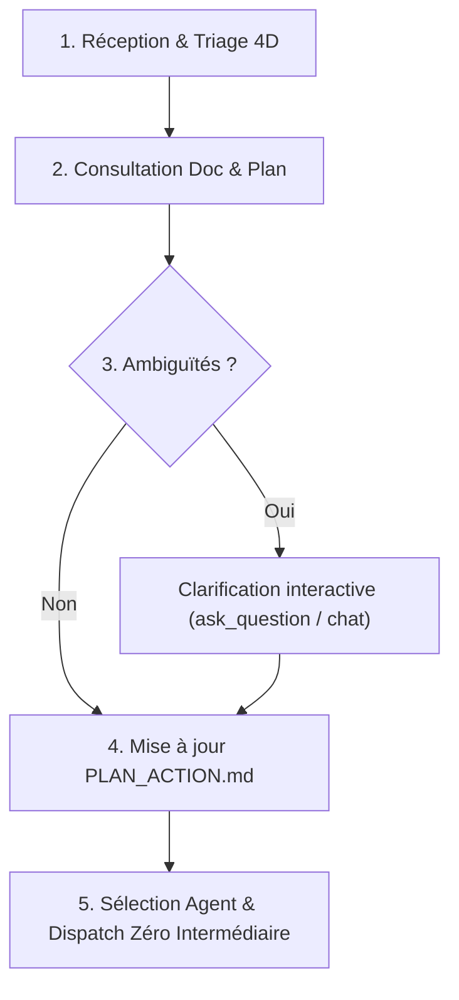

# triage-task

Ce workflow orchestre le cycle complet de **qualification, d'évaluation, de clarification, d'alignement stratégique avec la documentation et le plan d'action, puis de dispatching multi-agents**.

Il permet de transformer n'importe quelle idée, questionnement, correctif ou nouvelle tâche en une action claire, documentée et routée vers le bon agent sans perte de contexte.

---

## Syntaxe & Utilisation

```bash
/triage-task "Description de la tâche, du bug, de la question ou de l'idée"
```

### Variantes et Alias d'appel
- `/triage "..."` (alias direct court)
- `/eval "..."` (alias court pour évaluation)
- Arguments ou flags optionnels pris en charge :
  - `--auto` : Évaluation + mise à jour du plan + dispatch immédiat vers l'agent cible sans étape intermédiaire si aucune ambiguïté n'est détectée.
  - `--dry-run` : Évaluation, analyse d'impact et recommandations sans modifier le plan d'action ni lancer de dispatch.
  - `--plan-only` : Évaluation et ajout ordonné au plan d'action (`PLAN_ACTION.md`) sans lancer l'exécution.

---

## Protocole en 5 Étapes



---

### Étape 1 : Évaluation et Triage 4D

Lorsqu'une demande est soumise, réaliser une analyse rapide sur 4 dimensions :

1. **Typologie de l'intervention** :
   - 🐞 **Correctif / Bugfix** (régression, lien brisé, erreur de schéma, bug UI).
   - ✨ **Fonctionnalité / User Story** (nouveau composant, nouvel écran, enrichissement graphe).
   - ❓ **Questionnement / Architecture** (arbitrage technique, validation de faisabilité, interrogation sur les données).
   - 🧹 **Refactorisation / Dette technique** (nettoyage de code, optimisation de performance, factorisation).

2. **Analyse d'Impact & Risque (GitNexus)** :
   - Si la demande touche au code existant, exécuter systématiquement l'analyse d'impact :
     - Utiliser `impact({target: "symbolName", direction: "upstream"})` ou les requêtes GitNexus.
     - Classifier le risque : `FAIBLE`, `MOYEN`, `ÉLEVÉ`, `CRITIQUE` ou `UNKNOWN` (à confirmer par recherche textuelle).

3. **Estimation d'Effort (T-Shirt Size)** :
   - `XS` (< 15 min, correctif mineur)
   - `S` (< 1h, composant isolé ou script simple)
   - `M` (demi-journée, fonctionnalité multi-fichiers)
   - `L` / `XL` (chantier architectural, migration de schéma)

4. **Recommandation du Modèle LLM pour Antigravity** :
   - **Gemini 3.8 Flash** / **Gemini 3.6 Flash** : Tâches courantes, intégration UI Astro/Tailwind, scripts de routine ($0.075 / 1M In).
   - **Gemini 3.1 Pro** ou **Claude 3.7 Sonnet** : Raisonnement abstrait lourd, refactoring architectural complexe, débogage subtil.

---

### Étape 2 : Consultation Documentaire et Alignement avec le Plan

Avant de formuler une réponse ou de planifier :

1. **Vérification du Plan d'Action** :
   - Consulter `packages/ckg/PLAN_ACTION.md` pour :
     - Vérifier si la tâche est déjà répertoriée ou si elle dépend d'une tâche existante.
     - Identifier la phase correspondante :
       - **Phase A** : Neo4j & Ingestion graphe (relations, ontologie).
       - **Phase B** : Le Siphon & Supabase (synchronisation, schémas SQL).
       - **Phase C** : Vitrine Frontend Astro (composants, pages, UI/UX).
       - **Phase D** : Tests, validation psychométrique, QA.
       - **Infrastructure / Monorepo** : Docker, Vercel, configurations transverses.

2. **Consultation des Documents de Référence (si pertinent)** :
   - Psychométrie & Méthodologie : `docs/MANUEL_SCORING_METHODOLOGIE_PSYCHOMETRIQUE.md`
   - Règles d'or CKG & Base : `.agents/rules/ckg-current-state.md`, `.agents/rules/data-transformation.md`
   - Règles UI : `.agents/rules/frontend-pedagogy.md`
   - Schémas réels de données : outils MCP `get_neo4j_schema` ou `mcp_supabase-mcp-server_*`.

---

### Étape 3 : Questions d'Éclaircissement (si nécessaire)

Si la demande est ambiguë, incomplète ou présente des arbitrages critiques :
- **Utiliser l'outil `ask_question`** s'il s'agit d'un choix multiple clair (ex: choix entre deux architectures, priorité d'exécution, intégration immédiate vs différée).
- Ou formuler **1 à 3 questions précises et numérotées** dans la réponse :
  - Quel est le comportement cible attendu ?
  - Faut-il impacter les données existantes en base ou uniquement la couche présentation ?
  - La tâche doit-elle bloquer les développements en cours ?

> **Note d'optimisation** : Si la consigne est déjà parfaitement limpide et univoque, ne pas ralentir le flux avec des questions superflues ; passer directement à l'étape 4.

---

### Étape 4 : Inscription au Plan d'Action (`PLAN_ACTION.md`)

Si la tâche constitue un élément à suivre ou planifier :

1. Ouvrir `packages/ckg/PLAN_ACTION.md`.
2. Insérer la tâche dans la section appropriée avec le format standardisé du projet :
   ```markdown
   - [ ] **[ID_OU_TITRE]** [Agent Cible] Description de la tâche
     - **Objectif** : ...
     - **Priorité** : P0 (Bloquant) | P1 (Important) | P2 (Secondaire)
     - **Fichiers impactés** : `chemin/vers/fichier`
   ```
3. Si la tâche vient d'être résolue immédiatement (ex: bugfix express), l'inscrire directement avec la mention `- [x] FAIT` et la date du jour.
4. Si l'utilisateur a spécifié `--dry-run`, sauter cette étape de modification de fichier.

---

### Étape 5 : Sélection de l'Agent et Dispatching (Zéro Intermédiaire)

Déterminer l'agent le plus qualifié selon la matrice Trajektia :

| Domaine / Nature de la mission | Agent Cible | Mode d'exécution direct |
| :--- | :--- | :--- |
| **Idéation UI, concepts d'écrans, Design System textuel** | **Google Stitch (MCP)** | Outils `mcp_StitchMCP_*` |
| **Inspection pixel-perfect Figma, tokens CSS, Auto Layout** | **Figma (MCP)** | Inspection et extraction de variables |
| **Scripts Python pur, refactorisation backend, algorithmes CKG** | **Claude Code Router (CCR)** | Transmission directe via CLI `ccr` ou API `http://localhost:3458` |
| **Analyse documentaire massive, crosswalks, batch Flash économique** | **Gemini CLI** | Commande CLI avec grand contexte |
| **Notifications Telegram, communication asynchrone** | **Hermes Agent (MCP)** | Outil `mcp_hermes_messages_send` |
| **Exploration données lourdes, validation requêtes SQL/Neo4j** | **Google Jules / Direct MCPs** | MCPs Neo4j / Supabase ou tâche Jules |
| **Intégration Astro/React, refontes frontend, coordination multi-fichiers** | **Antigravity (IDE)** | Prise en charge directe avec le modèle adéquat |

#### Exécution du Dispatch :
- **Mode Zéro Intermédiaire** : Si l'utilisateur a demandé d'exécuter la tâche ou si le flag `--auto` est actif, déclencher l'agent ou démarrer le travail directement sans exiger de copier-coller de la part de l'utilisateur.
- **Rapport de Triage** : Si la tâche est en attente d'arbitrage, présenter une synthèse structurée :
  1. Résumé de l'analyse & Risque GitNexus.
  2. Statut dans le plan d'action (`PLAN_ACTION.md`).
  3. Agent et modèle recommandés.
  4. Actions proposées pour lancer l'exécution.

---

## Règle de Clôture Obligatoire

Toute exécution du workflow `/triage-task` doit obligatoirement se conclure par le bloc standardisé Trajektia (`response-summary-format.md`) avec ses 6 lignes strictes.
