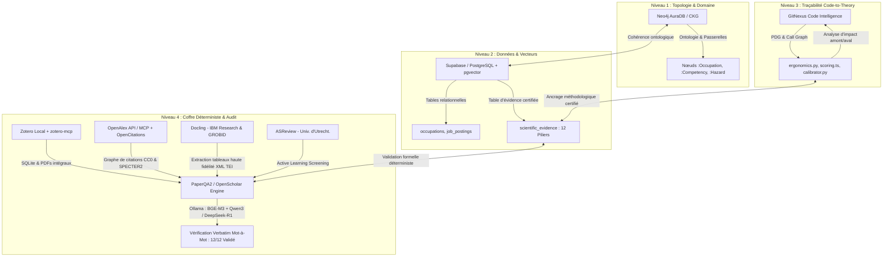

# 📖 Manuel Méthodologique — Trajektia Career Knowledge Graph (CKG)
**Version : 1.0.0 | Rédigé en : Septembre 2026 | Statut : Document de référence scientifique et technique**

> Ce document constitue la référence scientifique, technique et méthodologique exhaustive du système de données Trajektia. Il est destiné à l'équipe technique, aux partenaires académiques, aux auditeurs de données et à toute personne souhaitant comprendre ou expliquer la construction du Career Knowledge Graph.

---

## Table des Matières

1. [Philosophie et Objectifs Scientifiques](#1-philosophie-et-objectifs-scientifiques)
2. [Architecture Générale du Système](#2-architecture-générale-du-système)
3. [Taxonomies et Référentiels](#3-taxonomies-et-référentiels)
4. [Sources de Données Primaires](#4-sources-de-données-primaires)
5. [Pipelines ETL — Extraction, Transformation, Chargement](#5-pipelines-etl--extraction-transformation-chargement)
6. [Modélisation du Graphe de Connaissances (Neo4j)](#6-modélisation-du-graphe-de-connaissances-neo4j)
7. [Modélisation Relationnelle (Supabase / PostgreSQL)](#7-modélisation-relationnelle-supabase--postgresql)
8. [Méthodes Statistiques et Formules](#8-méthodes-statistiques-et-formules)
9. [Module SST — Santé et Sécurité au Travail (CNESST)](#9-module-sst--santé-et-sécurité-au-travail-cnesst)
10. [Module Ergonomie, Aptitude à l'Emploi & Réadaptation (c.o. & CNESST)](#10-module-ergonomie-aptitude-à-lemploi--réadaptation-co--cnesst)
11. [Module Formations — MEQ / La Relance](#11-module-formations--meq--la-relance)
12. [Module Compétences Vertes ESCO](#12-module-compétences-vertes-esco)
13. [Contrôle Qualité et Intégrité des Données](#13-contrôle-qualité-et-intégrité-des-données)
14. [Calendrier de Maintenance](#14-calendrier-de-maintenance)
15. [Glossaire Technique](#15-glossaire-technique)
16. [Nouvelles Sources de Données Futures (Phase I)](#16-nouvelles-sources-de-données-futures-phase-i)
17. [Modélisation de la Personnalité (Big Five / OCEAN)](#17-modélisation-de-la-personnalité-big-five--ocean)
18. [Moteur de Recherche Sémantique, Traitements Vectoriels & Data Science Avancée](#18-moteur-de-recherche-sémantique-traitements-vectoriels--data-science-avancée)
19. [Module de Test Psychométrique Interactif (Big Five & RIASEC)](#19-module-de-test-psychométrique-interactif-big-five--riasec)
20. [Architecture de Preuve Scientifique Souveraine & Moteur d'Audit RAG](#20-architecture-de-preuve-scientifique-souveraine--moteur-daudit-rag)
21. [Observatoire Temporel des Marchés & Modélisation Trajektia Live™ 12-14 Mois](#21-observatoire-temporel-des-marchés--modélisation-trajektia-live-12-14-mois)

---

## 1. Philosophie et Objectifs Scientifiques

### 1.1 Problème résolu

Les plateformes d'orientation professionnelle traditionnelles présentent généralement une information fragmentée et cloisonnée :
- Les **données de compétences** sont séparées des **données salariales**.
- Les **données de formation** sont séparées des **perspectives d'emploi**.
- Les **conditions de travail réelles** (ergonomie, risques SST) sont systématiquement absentes.
- Les **équivalences internationales** (Canada ↔ USA ↔ Europe) ne sont pas exploitées.

### 1.2 La réponse Trajektia : le Career Knowledge Graph

Trajektia construit un **graphe de connaissances multi-dimensionnel** (Career Knowledge Graph, ou CKG) qui :

1. **Centralise** toutes les sources de données officielles dans un modèle unifié.
2. **Relie** les professions aux compétences, aux formations, aux salaires, aux outils, aux profils psychométriques et aux conditions de travail.
3. **Traverse** les frontières taxonomiques (CNP canadienne ↔ O\*NET américain ↔ ESCO européen).
4. **Quantifie** les risques professionnels à partir de données réelles d'accidents du travail.

### 1.3 Principes directeurs

| Principe | Description |
|:---|:---|
| **Données ouvertes** | Toutes les sources primaires sont des données gouvernementales ouvertes (CC-BY 4.0 ou équivalent). |
| **Traçabilité** | Chaque donnée est associée à sa source, sa date de publication et sa version. |
| **Idempotence** | Tous les pipelines ETL peuvent être relancés sans créer de doublons (upsert). |
| **Séparation des responsabilités** | Neo4j stocke les relations, Supabase stocke les données descriptives. |
| **Orientation positive** | Les risques sont présentés avec leurs mesures de prévention, jamais de façon alarmiste. |

---

## 2. Architecture Générale du Système

### 2.1 Vue d'ensemble

```
┌────────────────────────────────────────────────────────────────────────────────────────┐
│                              SOURCES DE DONNÉES PRIMAIRES                              │
│                                                                                        │
│  SIPeC/OaSIS    O*NET 28.2    ESCO v1.1.1    MEQ/Relance    CNESST 2023    EDSC GC 2016│
│  (Canada EDSC)  (USA USDOL)   (UE Cedefop)   (Québec MEQ)   (Québec)       (Phys./DPC) │
└──────────────────────────────┬─────────────────────────────────────────────────────────┘
                               │
                               ▼
┌────────────────────────────────────────────────────────────────────────────────────────┐
│                              PIPELINES ETL (Python)                                    │
│                                                                                        │
│  seed_total_sipec.py     │ onet_tech_ingestor.py            │ meq_relance_ingestor.py   │
│  le_siphon.py            │ unified_crosswalk_loader.py      │ cnesst_supabase_ingestor  │
│  tcc_synonyms_ingestor   │ physical_demands_dpc_ingestor.py │ check_db.py               │
└──────────────┬──────────────────────────────────────────┬──────────────────────────────┘
               │                                          │
               ▼                                          ▼
┌──────────────────────────────┐          ┌──────────────────────────────────────────────┐
│      NEO4J (AuraDB)          │          │            SUPABASE / PostgreSQL             │
│   Career Knowledge Graph     │          │            L'Encyclopédie Trajektia          │
│                              │          │                                              │
│  • Nœuds : Occupation,       │          │  • occupations (3 871 métiers)               │
│    Competency, Tool,         │          │  • competencies + occupation_competencies    │
│    Software, OccupHazard...  │          │  • educational_institutions (539)            │
│  • Relations : REQUIRES,     │          │  • educational_programs (220)                │
│    EQUIVALENT_TO,            │          │  • occupation_programs (964 liens)           │
│    MAPS_TO_ESCO, HAS_RISK... │          │  • occupational_hazards (7 catégories)       │
│  • Contrainte d'unicité sur  │          │  • cnesst_sector_stats (20 secteurs)         │
│    la propriété 'code'       │          │  • occupation_hazards (3 698 liens)          │
│  • Propriétés ergo/DPC sur   │          │  • occupation_physical_demands (504 profils) │
│    886 nœuds (:Occupation)   │          │                                              │
│                              │          │                                              │
│  ~250 000+ relations totales │          │                                              │
└──────────────┬───────────────┘          └──────────────────────┬───────────────────────┘
               │                                                 │
               └────────────────────────┬────────────────────────┘
                                        │
                                        ▼
┌────────────────────────────────────────────────────────────────────────────────────────┐
│                              COUCHE API & PRÉSENTATION                                 │
│                                                                                        │
│        Directus (Headless CMS)  ──────►  Astro (Frontend Statique)                     │
│        API REST + GraphQL                Site Web Trajektia                            │
└────────────────────────────────────────────────────────────────────────────────────────┘
```

### 2.2 La règle d'or : séparation Neo4j / Supabase

| Type de donnée | Destination | Justification technique |
|:---|:---|:---|
| Identifiants, titres courts | **Neo4j** | Nœuds légers pour la traversée rapide du graphe |
| Relations entre entités | **Neo4j** | Les arêtes sont le cœur du CKG |
| Textes descriptifs longs | **Supabase** | Évite de surcharger le graphe |
| Statistiques numériques | **Supabase** | Affichage tabulaire sur le site web |
| Salaires, taux de placement | **Supabase** | Requêtes filtrées efficaces via SQL |
| Données géospatiales | **Supabase** | PostGIS + index géographiques |

---

## 3. Taxonomies et Référentiels

### 3.1 La Classification Nationale des Professions (CNP 2021)

La **CNP** est le référentiel canadien officiel des professions, maintenu par Emploi et Développement Social Canada (EDSC).

**Structure hiérarchique :**
```
CNP 2021 v1.0
├── Grand Groupe (1 chiffre) : 0-9
│   ├── Sous-grand Groupe (2 chiffres)
│   │   ├── Sous-groupe Intermédiaire (3 chiffres)
│   │   │   └── Groupe de Base (4 chiffres)
│   │   │       └── Appellation d'emploi (5 chiffres) ← niveau opérationnel
```

**Correspondance groupes → secteurs (utilisée pour le mapping SST) :**

| 1er chiffre CNP | Grand Groupe | Secteur SCIAN associé |
|:---:|:---|:---|
| 0 | Gestion | Administration publique / Commerce |
| 1 | Affaires, finance, administration | Finance et assurances / Admin. publique |
| 2 | Sciences naturelles et appliquées | Informatique / Ingénierie / R&D |
| 3 | Soins de santé | Soins de santé et assistance sociale |
| 4 | Éducation, droit, sciences sociales | Services d'enseignement / Admin. publique |
| 5 | Arts, culture, sports | Information, culture et loisirs |
| 6 | Ventes et services | Commerce de détail / Hébergement-restauration |
| 7 | Métiers, transport et machinerie | Construction / Fabrication |
| 8 | Ressources naturelles et agriculture | Agriculture / Forêt / Mines |
| 9 | Fabrication et services publics | Fabrication / Énergie |

### 3.2 O\*NET-SOC (USA)

Le Standard Occupational Classification américain, étendu par le **O\*NET** (Occupational Information Network), fournit des profils psychométriques standardisés pour 1 016 occupations.

**Clé de liaison avec CNP :** `noc_onet_mapping.csv` (1 467 liens certifiés EDSC).

### 3.3 ESCO (Europe)

La **European Skills, Competences, Qualifications and Occupations** taxonomy de la Commission Européenne (Cedefop) couvre 2 942 professions et 13 890 compétences/aptitudes en 27 langues.

**Filtre stratégique Trajektia :** Seules les **compétences vertes** (`isGreenSkill = true`) sont ingérées pour éviter l'explosion combinatoire du graphe.

### 3.4 SCIAN (Système de Classification des Industries de l'Amérique du Nord)

Référentiel sectoriel utilisé par la CNESST pour identifier le secteur de l'employeur déclarant un accident. C'est le pivot central du module SST.

---

## 4. Sources de Données Primaires

### 4.1 Tableau récapitulatif

| Source | Organisme | Version | Volumétrie clé | Licence |
|:---|:---|:---|:---|:---|
| SIPeC 2025 / OaSIS | EDSC (Canada) | v1.1 (jan. 2025) | 35 117 compétences, 19 833 titres, 3 361 métiers | Gouvernement du Canada |
| Salaires Guichet-Emploi | EDSC (Canada) | Éd. 2025 | 3 361 salaires bas/médian/haut | Gouvernement du Canada |
| O\*NET Database | USDOL (USA) | Release 28.2 (2024-2025) | 109 244 rel. psychométriques, 32 435 logiciels, 26 388 outils | CC-BY 4.0 US Gov |
| Crosswalks CNP↔O\*NET | EDSC + Trajektia | 2025.1 | 1 467 liens | Gouvernement du Canada |
| Crosswalks O\*NET↔ESCO | USDOL + Cedefop | 2024-2025 | 4 253 liens | CC-BY UE / US Gov |
| ESCO Occupations | Commission Européenne | v1.1.1 (API 2025) | 1 818 métiers enrichis FR/EN | CC-BY 4.0 UE |
| Établissements Québec | MEQ / MES | Fév. 2026 | 539 établissements | CC-BY 4.0 QC |
| Enquête La Relance | MEQ (Québec) | 2019-2023 | 220 programmes, 964 liaisons CNP | CC-BY 4.0 QC |
| SST / CNESST | CNESST (Québec) | Millésime 2023 | 114 345 lésions, 3 698 liaisons | CC-BY 4.0 QC |
| Exigences Physiques & DPC | EDSC (Canada) | GC 2016 (Ouvert Canada) | 504 métiers cotés (forces, postures, DPC) | CC-BY 4.0 Canada |
| Concordance CNP 2016-2021 | Statistique Canada | v1.0 officiel | 585 règles de conversion certifiées | Statistique Canada |
| Synonymes TCC 2025 | EDSC (Canada) | v1.0 (2025) | 1 028 synonymes bilingues FR/EN | CC-BY 4.0 Canada |
| Devis Ministériels MES | MEQ / MES (Québec) | 2024-2026 | Devis ministériels structurés en 4 niveaux | CC-BY 4.0 QC |

### 4.2 Données SIPeC/OaSIS — Fichiers CSV traités

| Fichier CSV | Contenu | Taille |
|:---|:---|:---:|
| `enonce-principal_sipec_2025_v1.0_fr.csv` | Descriptions officielles des métiers | ~12 Mo |
| `fonctions-principales_sipec_2025_v1.1_fr.csv` | Tâches et fonctions par métier | ~8 Mo |
| `exemples-dappellation-demploi_sipec_2025_v1.0_fr.csv` | 19 833 appellations d'emploi | ~3 Mo |
| `competencesprincipales_sipec_v1.0-fr_fr.csv` | 35 117 relations CNP↔Compétences | ~5 Mo |
| `exigences-demploi_sipec_2025_v1.0_fr.csv` | Scolarité requise, certifications | ~2 Mo |

---

## 5. Pipelines ETL — Extraction, Transformation, Chargement

### 5.1 Principes communs à tous les pipelines

**Langage :** Python 3.11+

**Bibliothèques clés :**
```python
import pandas as pd          # Manipulation et agrégation de données tabulaires
import psycopg2              # Connexion PostgreSQL/Supabase avec transactions ACID
from neo4j import GraphDatabase  # Connexion au graphe Neo4j AuraDB
import requests              # Téléchargement HTTP des fichiers sources
import re                    # Expressions régulières (matching de titres de métiers)
```

**Patron de connexion à Supabase (transactionnel) :**
```python
conn = psycopg2.connect(
    host=PG_HOST, port=PG_PORT, dbname=PG_DB,
    user=PG_USER, password=PG_PASSWORD
)
conn.autocommit = False  # Mode transactionnel explicite (atomicité garantie)
cursor = conn.cursor()

try:
    # ... opérations d'ingestion ...
    conn.commit()
except Exception as e:
    conn.rollback()
    raise
finally:
    cursor.close()
    conn.close()
```

**Patron d'upsert idempotent (PostgreSQL ON CONFLICT) :**
```sql
INSERT INTO table_cible (colonne1, colonne2, ...)
VALUES (%s, %s, ...)
ON CONFLICT (cle_unique) DO UPDATE SET
    colonne2 = EXCLUDED.colonne2,
    updated_at = NOW();
```
> Ce patron garantit que relancer le pipeline plusieurs fois ne crée jamais de doublons.

### 5.2 Pipeline SIPeC — `seed_total_sipec.py`

**Flux de traitement :**
```
ZIP EDSC → Extraction CSV → Nettoyage (strip, normalize) → Upsert Neo4j (nœuds Occupation, Competency) → Upsert Supabase (tables occupations, competencies, occupation_competencies)
```

**Transformations clés :**
- Normalisation des codes CNP : remplissage à 5 chiffres avec zéros (`str.zfill(5)`)
- Déduplication sur la clé `cnp_code`
- Jointure interne des niveaux de compétence (`niveau_importance`, `niveau_complexite`)

### 5.3 Pipeline O\*NET — `onet_tech_ingestor.py`

**Flux de traitement :**
```
Fichiers TSV O*NET (db_28_2_text/) → Lecture pandas → Crosswalk O*NET→CNP → Upsert Neo4j → Synchronisation Supabase
```

**Détail des jointures :**
```python
# Jointure O*NET SOC vers CNP via le crosswalk
df_tech = pd.read_csv("Technology Skills.txt", sep="\t")
df_crosswalk = pd.read_csv("noc_onet_mapping.csv")

df_merged = df_tech.merge(df_crosswalk, left_on="O*NET-SOC Code", right_on="onet_code")
# → Permet d'associer chaque logiciel à son équivalent CNP canadien
```

### 5.4 Pipeline MEQ/Relance — `meq_relance_ingestor.py`

**Flux de traitement :**
```
3 CSV MEQ (géospatial) + 2 CSV Relance → Nettoyage → Upsert institutions → Upsert programmes → Génération liaisons CNP↔Programmes → Upsert occupation_programs
```

**Algorithme de matching CNP ↔ Programme :**
```python
# Matching par mots-clés normalisés (lowercase, accents supprimés)
def normalize(text):
    return unidecode(text.lower().strip())

# Dictionnaire de correspondance programme → CNP
PROGRAMME_TO_CNP = {
    "electricite": ["72200", "72201"],
    "informatique": ["21232", "21311"],
    "soins infirmiers": ["31301", "31302"],
    # ... 220+ entrées
}

for prog_name, cnp_list in PROGRAMME_TO_CNP.items():
    if prog_name in normalize(programme["nom_programme"]):
        for cnp in cnp_list:
            insert_occupation_program(cnp, programme["prog_id"], "directe")
```

### 5.5 Pipeline CNESST — `cnesst_supabase_ingestor.py`

**Flux de traitement :**
```
CSV CNESST (114 345 lésions) → Téléchargement/Cache → Agrégation par secteur SCIAN → Calcul des taux de risque → Mapping SCIAN→CNP (2 niveaux) → Upsert Supabase (3 tables) → Enrichissement Neo4j (HAS_RISK)
```

**Voir Section 9 pour le détail complet de ce pipeline.**

### 5.6 Le Siphon — `le_siphon.py`

Script de synchronisation ETL Neo4j → Supabase (8 phases de synchronisation).

**Ce qu'il transfère :**

| Données sources (Neo4j) | Table cible (Supabase) | Transformation |
|:---|:---|:---|
| Nœuds `(:Occupation)` | `occupations` | Propriétés → colonnes SQL |
| Nœuds `(:Competency)` | `competencies` | Titres multilingues |
| Relations `[:REQUIRES]` | `occupation_competencies` | Avec score d'importance |
| Nœuds `(:Tool)` | `tools` | Nom + catégorie |
| Relations `[:USES_TOOL]` | `occupation_tools` | Score d'utilisation |
| Propriétés RIASEC | `riasec_profiles` | 6 dimensions normalisées |
| Propriétés Ergonomiques, DPC & Axes Prediger (Nœuds `(:Occupation)`) | `occupation_physical_demands` | **Phase 8** : Extraction Cypher des cotes S/B/L/V/C/H, DPC et axes Prediger (T/P, D/I) ; mapping des libellés FR via `STRENGTH_LABELS` et `POSITION_LABELS_REV` ; conversion DPC et parse sécurisé de `max_weight_kg` ; UPSERT SQL avec clauses `COALESCE` sur conflit pour préserver les colonnes pré-existantes (vision, audition, motricité). |
| Demande Marché Job Bank (Nœuds `(:MarketDemand)`) | `trajektia_market_snapshots` & `occupations` | **Phase 9** : Extraction des offres d'emploi actives et date de snapshot. UPSERT du `postings_volume` dans `trajektia_market_snapshots` et mise à jour sécurisée (avec `COALESCE`) de la colonne `active_job_postings` dans `occupations`. |

### 5.7 Pipeline Exigences Physiques & DPC — `physical_demands_dpc_ingestor.py`

**Flux de traitement :**
```
CSV GC 2016 (Activités Physiques) + CSV GC 2016 (DPC) 
  → Normalisation des codes CNP 2016 
  → Jointure Concordance StatCan CNP 2016↔2021 (585 paires) 
  → Résolution des codes décimaux vers les 510+ groupes unitaires CNP 2021 
  → Calcul des coordonnées cartésiennes de Prediger (T/P et D/I) 
  → Upsert Supabase (table occupation_physical_demands, 504 métiers) 
  → Enrichissement Neo4j (886 nœuds :Occupation mis à jour)
```

**Principales résolutions techniques :**
- Gestion des encodages accentués Windows (cp1252/latin1 vs utf-8) sur les colonnes sources (`Données`, `Ouïe`).
- Rapprochement des sous-groupes décimaux du Guide des carrières (ex: `3131.1` $\rightarrow$ `31301`).
- Injection bivalente : stockage relationnel riche (SQL) + indexation rapide sur nœuds de graphe (Cypher).

### 5.8 Pipeline de Génération du Contenu Métiers & Déduplication O\*NET — `generate_career_content.py`

**Objectif :** Produire le fichier de données statiques TypeScript (`apps/frontend/src/data/metiers.ts`) alimentant les pages fiches métiers Astro (`/metiers/[cnp].astro`). Ce script agrège l'ensemble des données multi-sources (descriptions, DPCI, Prediger, Work Styles, compétences OaSIS, formations MEQ, risques CNESST).

**Problématique de la correspondance 1-à-plusieurs (Crosswalk Multiplicity) :**
Dans la table de correspondance `noc_onet_mapping.csv`, un code CNP canadien correspond fréquemment à 2 à 4 codes O\*NET SOC américains (ex: la CNP 21232 *Développeurs de logiciels* correspond simultanément aux codes SOC 15-1252.00, 15-1253.00 et 15-1254.00). Une jointure directe produisait une explosion combinatoire des descripteurs comportementaux (*Work Styles*), générant jusqu'à 714 doublons d'items pour une seule fiche profession.

**Résolution à double verrouillage (SQL + Python) :**
1. **Agrégation SQL par moyenne arithmétique arrondie :**
   ```sql
   SELECT 
       ws.style_id,
       ws.nom_style_fr,
       ROUND(AVG(ws.score))::int as score,
       ws.importance_score,
       ws.work_impact_score
   FROM occupation_work_styles ws
   WHERE ws.occupation_code = %s
   GROUP BY ws.style_id, ws.nom_style_fr, ws.importance_score, ws.work_impact_score
   ORDER BY score DESC
   ```
2. **Filtrage défensif en mémoire (`deduplicate_work_styles`) :**
   Une fonction de déduplication stricte basée sur un ensemble de contrôle (`seen_ids`) garantit qu'aucune facette ne peut apparaître plus d'une fois, plafonnant la matrice à exactement **21 facettes O\*NET uniques maximum** par profession.
3. **Calcul et Normalisation du Pôle « Idées » DPCI :**
   Le script extrait les cotes $D, P, C$ de la table `occupation_physical_demands`, calcule le pôle $I = \min(5, \max(1, \text{round}((I_{\text{RIASEC}} + A_{\text{RIASEC}}) / 20)))$ et projette les coordonnées cartésiennes de Prediger $(T/P, D/I)$ sur l'intervalle $[-85, +85]$.

---

## 6. Modélisation du Graphe de Connaissances (Neo4j)

### 6.1 Schéma de nœuds

```cypher
// Profession canadienne
(:Occupation {
    code: "CNP-31301",         // Identifiant unique contraint (CNP 2021)
    title_fr: "Infirmiers autorisés",
    title_en: "Registered Nurses",
    median_salary: 41.5,         // Salaire horaire médian (ESDC 2025)
    salary_source: "ESDC 2025",
    taxonomy: "CNP"
})

// Compétence professionnelle
(:Competency {
    competency_id: "sipec_3230_communication",
    title_fr: "Communication interpersonnelle",
    source: "SIPeC 2025"
})

// Logiciel ou technologie
(:Software {
    name: "Epic Systems",
    hot_technology: true,
    source: "O*NET 28.2"
})

// Outil physique
(:Tool {
    name: "Défibrillateur cardiaque",
    category: "Équipement médical"
})

// Risque professionnel SST
(:OccupationalHazard {
    hazard_id: "TMS",
    name_fr: "Troubles musculo-squelettiques",
    source: "CNESST 2023"
})

// Demande sur le marché du travail (Job Bank)
(:MarketDemand {
    source: "JobBank",
    active_postings: 14,
    date: "2026-09"
})
```

### 6.2 Schéma de relations (arêtes)

```cypher
// Compétence requise
(:Occupation)-[:REQUIRES {
    importance_level: 4,    // Échelle 1-5 (SIPeC)
    complexity_level: 3
}]->(Competency)

// Logiciel requis
(:Occupation)-[:REQUIRES_SOFTWARE {
    hot_technology: true    // Technologie émergente (O*NET)
}]->(Software)

// Outil utilisé
(:Occupation)-[:USES_TOOL {
    relevance_score: 0.87
}]->(Tool)

// Pont taxonomique CNP → O*NET
(:Occupation {taxonomy:"CNP"})-[:EQUIVALENT_TO]->(Occupation {taxonomy:"O*NET"})

// Pont taxonomique O*NET → ESCO
(:Occupation {taxonomy:"ONET"})-[:MAPS_TO_ESCO]->(Occupation {taxonomy:"ESCO"})

// Risque professionnel
(:Occupation)-[:HAS_RISK {
    risk_level: "Élevé",     // Élevé | Moyen | Faible
    frequency_pct: 20.46,    // Prévalence dans le secteur (%)
    source: "CNESST 2023"
}]->(OccupationalHazard)

// Offres d'emploi et tension marché
(:Occupation)-[:HAS_DEMAND]->(MarketDemand)

// Adéquation Personne-Poste (PR-RSM & TAT)
(:User)-[:EVALUE_FIT_PR_RSM {
    b0: 4.693, b1_X: 0.055, b2_Y: 0.533, b3_X2: -0.033, b4_XY: 0.018, b5_Y2: 0.046,
    a1_LOC_slope: 0.588, a3_LOIC_slope: -0.478, predicted_satisfaction: 4.85,
    strain_level: "Faible (Zone Suggérée)"
}]->(Occupation)
```

### 6.3 Volumétrie totale du graphe (Septembre 2026)

| Type d'entité / Relation | Quantité |
|:---|---:|
| Nœuds `(:Occupation)` — toutes taxonomies | ~6 000 |
| Nœuds `(:MarketDemand)` — offres d'emploi Job Bank | 424 |
| Relations `[:REQUIRES]` compétences SIPeC | 35 117 |
| Relations `[:REQUIRES_SOFTWARE]` O\*NET | 32 435 |
| Relations `[:USES_TOOL]` O\*NET | 26 388 |
| Relations psychométriques O\*NET (aptitudes, styles, valeurs, RIASEC) | 109 244 |
| Relations de connaissance O\*NET | 6 566 |
| Relations de contexte de travail O\*NET | 21 953 |
| Ponts `[:EQUIVALENT_TO]` (CNP ↔ O*NET) | 911 |
| Ponts `[:EQUIVALENT_TO]` (O*NET ↔ ESCO) | 4 253 |
| Relations `[:HAS_RISK]` SST/CNESST | 1 496 |
| Relations `[:HAS_DEMAND]` Job Bank (QC) | 424 |
| **TOTAL estimé** | **~250 000+** |

---

## 7. Modélisation Relationnelle (Supabase / PostgreSQL)

### 7.1 Schéma des tables principales

```sql
-- Table centrale des professions
CREATE TABLE occupations (
    cnp_code         VARCHAR(10) PRIMARY KEY,  -- Ex: "31301"
    title_fr         TEXT NOT NULL,
    title_en         TEXT,
    onet_soc_code    VARCHAR(15),              -- Pont vers O*NET
    median_salary    NUMERIC(10,2),            -- $/heure (ESDC 2025)
    job_zone         INTEGER REFERENCES job_zones_reference(job_zone), -- Niveau de préparation 1-5 (O*NET/TEER)
    sector_scian     VARCHAR(10),             -- Secteur d'industrie principal
    salary_source    TEXT DEFAULT 'ESDC 2025',
    created_at       TIMESTAMPTZ DEFAULT NOW(),
    updated_at       TIMESTAMPTZ DEFAULT NOW()
);

-- Référentiel des Job Zones O*NET (équivalence TEER / SVP)
CREATE TABLE job_zones_reference (
    job_zone         INTEGER PRIMARY KEY,      -- 1 à 5
    name_en          TEXT NOT NULL,
    name_fr          TEXT,
    experience_en    TEXT,
    experience_fr    TEXT,
    education_en     TEXT,
    education_fr     TEXT,
    job_training_en  TEXT,
    job_training_fr  TEXT,
    examples_en      TEXT,
    svp_range        TEXT,                     -- Ex: '(6.0 to < 7.0)'
    teer_equivalent  TEXT,                     -- Ex: 'TEER 3'
    created_at       TIMESTAMPTZ DEFAULT NOW(),
    updated_at       TIMESTAMPTZ DEFAULT NOW()
);

-- Table de liaison O*NET-SOC ↔ Job Zone
CREATE TABLE onet_job_zones (
    onet_soc_code    VARCHAR(15) PRIMARY KEY,
    job_zone         INTEGER REFERENCES job_zones_reference(job_zone),
    date_updated     VARCHAR(15),
    domain_source    VARCHAR(100),
    created_at       TIMESTAMPTZ DEFAULT NOW(),
    updated_at       TIMESTAMPTZ DEFAULT NOW()
);

-- Compétences professionnelles (SIPeC)
CREATE TABLE competencies (
    competency_id    TEXT PRIMARY KEY,
    title_fr         TEXT NOT NULL,
    category         TEXT,                     -- Ex: 'Compétences transversales'
    source           TEXT DEFAULT 'SIPeC 2025'
);

-- Liaisons métiers ↔ compétences (table pivot)
CREATE TABLE occupation_competencies (
    occupation_cnp_code  VARCHAR(10) REFERENCES occupations(cnp_code),
    competency_id        TEXT REFERENCES competencies(competency_id),
    importance_level     INTEGER,              -- Échelle 1-5
    complexity_level     INTEGER,
    PRIMARY KEY (occupation_cnp_code, competency_id)
);

-- Établissements d'enseignement (MEQ/MES)
CREATE TABLE educational_institutions (
    institution_id   TEXT PRIMARY KEY,         -- CD_ORGNS (identifiant MEQ)
    name             TEXT NOT NULL,
    institution_type TEXT,                     -- 'CFP' | 'Cégep' | 'Université'
    region_admin     INTEGER,                  -- Région administrative 01-17
    city             TEXT,
    website          TEXT,
    latitude         NUMERIC(9,6),
    longitude        NUMERIC(9,6)
);

-- Programmes de formation (La Relance)
CREATE TABLE educational_programs (
    program_id           SERIAL PRIMARY KEY,
    program_code         TEXT UNIQUE,          -- Code officiel MEQ
    name_fr              TEXT NOT NULL,
    level                TEXT,                 -- 'DEP' | 'DEC' | 'BAC' | 'Maîtrise'
    avg_weekly_salary    NUMERIC(10,2),        -- Salaire hebdo moyen à 31 mars
    employment_rate      NUMERIC(5,2),         -- % emploi relié à la formation
    cpe_code             TEXT REFERENCES cip_domains(cpe_code),
    data_year            INTEGER DEFAULT 2023
);

-- Risques SST — Référentiel (7 catégories)
CREATE TABLE occupational_hazards (
    hazard_id            TEXT PRIMARY KEY,     -- 'TMS' | 'SURDITE' | 'CHUTE' | ...
    name_fr              TEXT NOT NULL,
    description_fr       TEXT,
    prevention_advice_fr TEXT,
    source               TEXT DEFAULT 'CNESST'
);

-- Statistiques SST par secteur SCIAN
CREATE TABLE cnesst_sector_stats (
    sector_scian         TEXT NOT NULL,
    year                 INTEGER NOT NULL,
    total_lesions        INTEGER,
    pct_tms              NUMERIC(5,2),         -- % Troubles musculo-squelettiques
    pct_surdite          NUMERIC(5,2),         -- % Surdité industrielle
    pct_machine          NUMERIC(5,2),         -- % Accidents machines/outils
    pct_psy              NUMERIC(5,2),         -- % Risques psychosociaux
    top_genre_accident   TEXT,                 -- Mécanisme dominant (ex: 'EFFORT EXCESSIF')
    top_siege_lesion     TEXT,                 -- Siège corporel dominant (ex: 'DOS')
    PRIMARY KEY (sector_scian, year)
);

-- Liaisons métiers ↔ risques SST (table pivot)
CREATE TABLE occupation_hazards (
    occupation_cnp_code  VARCHAR(10) REFERENCES occupations(cnp_code),
    hazard_id            TEXT REFERENCES occupational_hazards(hazard_id),
    risk_level           TEXT,                 -- 'Faible' | 'Moyen' | 'Élevé'
    frequency_pct        NUMERIC(5,2),         -- Prévalence dans le secteur (%)
    notes_fr             TEXT,
    PRIMARY KEY (occupation_cnp_code, hazard_id)
);

-- Exigences physiques, contraintes ergonomiques & DPC (EDSC / GC 2016)
CREATE TABLE occupation_physical_demands (
    occupation_cnp_code             TEXT        PRIMARY KEY REFERENCES occupations(cnp_code) ON DELETE CASCADE,
    strength_code                   TEXT,                   -- 'S-1' à 'S-4'
    strength_label_fr               TEXT,                   -- 'Limitée (< 5 kg)', 'Légère (5-10 kg)', 'Moyenne (10-20 kg)', 'Lourde (> 20 kg)'
    max_weight_kg                   INTEGER,                -- 5, 10, 20, 50
    body_position_code              TEXT,                   -- 'B-1' (Assis), 'B-2' (Debout), 'B-3' (Courbé), 'B-4' (Grimper)
    body_position_label_fr          TEXT,
    limb_coordination_code          TEXT,                   -- 'L-0', 'L-1', 'L-2'
    vision_code                     TEXT,                   -- 'V-1', 'V-2', 'V-3'
    colour_code                     TEXT,                   -- 'C-0', 'C-1', 'C-2'
    hearing_code                    TEXT,                   -- 'H-1', 'H-2', 'H-3'
    dpc_data                        TEXT,                   -- ex: 'Synthétiser - 0'
    dpc_people                      TEXT,                   -- ex: 'Mentorat - 0'
    dpc_things                      TEXT,                   -- ex: 'Mise au point - 0'
    dpc_summary                     VARCHAR(20),            -- ex: 'D-0 | P-1 | C-8'
    prediger_things_people          TEXT,                   -- 'Choses (R)', 'Personnes (S)', 'Équilibré'
    prediger_data_ideas             TEXT,                   -- 'Données (C)', 'Idées (A/I)'
    source                          TEXT DEFAULT 'EDSC Career Handbook / StatCan CNP 2021',
    created_at                      TIMESTAMPTZ DEFAULT NOW(),
    updated_at                      TIMESTAMPTZ DEFAULT NOW()
);
```

### 7.2 Versions du schéma SQL

| Version | Fichier | Contenu |
|:---|:---|:---|
| V1 | `schema.sql` | Tables de base : `occupations`, `competencies`, `riasec_profiles` |
| V2 | `schema_v2.sql` | Extension OaSIS : hiérarchie CNP, tâches, contextes de travail |
| V3 | `schema_v3.sql` | Formations MEQ : `educational_institutions`, `programs`, `cip_domains` |
| V4 | `schema_v4_relance.sql` | Données La Relance : salaires et taux de placement |
| V5 | `schema_v5_cnesst.sql` | Module SST : `occupational_hazards`, `cnesst_sector_stats`, `occupation_hazards` |
| V6 | `schema_v6_physical_demands_dpc.sql` | Ergonomie & Aptitude : `occupation_physical_demands` (forces, postures, sensoriel, DPC) |
| V7 | `schema_v7_dpc_taxonomy.sql` | Taxonomie DPC & Explicabilité : `ref_dpc_taxonomy` (25 verbes, définitions FR/EN, vue enrichie) |
| V8 | `schema_v8_market_snapshots.sql` | Observatoire Temporel & Tendances : `trajektia_market_snapshots`, `trajektia_skill_demand_history`, `trajektia_live_job_postings` |
| V9 | `schema_v9_program_devis.sql` | Devis Ministériels MES : `program_competencies` (Codes ministériels 016K, savoir-faire, critères de performance) & champs descriptifs généraux sur `educational_programs` |

---

## 8. Méthodes Statistiques et Formules

### 8.1 Calcul de la prévalence sectorielle (Formule principale)

La métrique centrale de Trajektia est la **fréquence relative d'incidence** d'un type de risque dans un secteur industriel donné. Cette formule est standard en épidémiologie du travail :

$$\text{Prévalence}(X, S) = \frac{N_{X,S}}{N_{total,S}} \times 100$$

Où :
- $X$ = Type de risque (ex: TMS, Surdité, Psychosocial)
- $S$ = Secteur industriel (SCIAN)
- $N_{X,S}$ = Nombre de lésions de type $X$ enregistrées dans le secteur $S$
- $N_{total,S}$ = Nombre total de lésions enregistrées dans le secteur $S$ toutes causes confondues

**Exemple concret avec les données CNESST 2023 :**

```
Secteur "Soins de santé et assistance sociale"
  → N_total       = 34 944 lésions déclarées
  → N_TMS         = 7 151 lésions TMS identifiées (IND_LESION_TMS = 'OUI')
  → Prévalence_TMS = (7 151 / 34 944) × 100 = 20.46%
```

**Implémentation Python :**
```python
import pandas as pd

df = pd.read_csv("lesions_2023.csv", encoding="utf-8-sig")

# Agrégation par secteur
sector_stats = df.groupby("SECTEUR_SCIAN").agg(
    total_lesions   = ("IND_LESION_TMS", "count"),
    tms_count       = ("IND_LESION_TMS", lambda x: (x == "OUI").sum()),
    surdite_count   = ("IND_LESION_SURDITE", lambda x: (x == "OUI").sum()),
    machine_count   = ("IND_LESION_MACHINE", lambda x: (x == "OUI").sum()),
    psy_count       = ("IND_LESION_PSY", lambda x: (x == "OUI").sum()),
).reset_index()

# Calcul des prévalences
sector_stats["pct_tms"]     = (sector_stats["tms_count"] / sector_stats["total_lesions"] * 100).round(2)
sector_stats["pct_surdite"] = (sector_stats["surdite_count"] / sector_stats["total_lesions"] * 100).round(2)
sector_stats["pct_machine"] = (sector_stats["machine_count"] / sector_stats["total_lesions"] * 100).round(2)
sector_stats["pct_psy"]     = (sector_stats["psy_count"] / sector_stats["total_lesions"] * 100).round(2)
```

### 8.2 Calcul du facteur de sur-exposition (Qualification du niveau de risque)

Pour objectiver la qualification du niveau de risque (`Élevé`, `Moyen`, `Faible`), on utilise le **facteur de sur-exposition**, qui mesure l'écart entre le secteur étudié et la moyenne provinciale :

$$\text{Facteur de Sur-exposition}(X, S) = \frac{\text{Prévalence}(X, S)}{\overline{\text{Prévalence}}(X, QC)}$$

Où $\overline{\text{Prévalence}}(X, QC)$ est la moyenne pondérée sur l'ensemble des 114 345 lésions québécoises de 2023.

**Moyennes provinciales de référence (Québec 2023) :**

| Risque (X) | Moyenne provinciale QC ($\overline{p}$) |
|:---|:---:|
| TMS (Troubles musculo-squelettiques) | **21.0%** |
| Risques Psychosociaux (PSY) | **2.1%** |
| Surdité industrielle (BRUIT) | **1.5%** |
| Accidents Machines/Outillage (MACHINE) | **3.0%** |
| Chutes de hauteur et de plain-pied (CHUTE) | **8.0%** |

### 8.3 Grille de qualification du niveau de risque

| Facteur de Sur-exposition | Niveau attribué | Interprétation |
|:---:|:---:|:---|
| $\geq 2.5\times$ la moyenne | **Élevé** | Surexposition significative — axe de prévention prioritaire |
| $1.0\times$ à $2.5\times$ la moyenne | **Moyen** | Exposition présente, mais dans les normes sectorielles |
| $< 1.0\times$ la moyenne | **Faible** | Sous-exposition relative à la moyenne provinciale |

**Exemple de calcul complet pour CNP 31301 (Infirmiers autorisés) :**
```
Secteur : "Soins de santé et assistance sociale"

TMS :
  Prévalence(TMS, Santé) = 20.46%
  Moyenne_prov(TMS)       = 21.0%
  Facteur                 = 20.46 / 21.0 = 0.97 → [Moyen/Élevé limite]
  → Décision finale       = [Élevé] (seuil spécifique TMS > 20%)

Risques Psychosociaux :
  Prévalence(PSY, Santé)  = 6.73%
  Moyenne_prov(PSY)       = 2.1%
  Facteur                 = 6.73 / 2.1 = 3.2x → [Élevé]
```

> **Note méthodologique :** Pour le risque TMS, le seuil d'alerte est fixé à `> 20%` (et non `> 2.5×` la moyenne) car le TMS est transversal à quasi tous les secteurs. Un facteur multiplicatif ne serait pas discriminant.

**Implémentation Python :**
```python
PROVINCIAL_AVERAGES = {
    "TMS": 21.0, "PSY": 2.1, "SURDITE": 1.5, "MACHINE": 3.0, "CHUTE": 8.0
}

RISK_THRESHOLDS = {
    "TMS":     {"Élevé": 20.0, "Moyen": 10.0},
    "PSY":     {"Élevé": 5.0,  "Moyen": 2.0},
    "SURDITE": {"Élevé": 6.0,  "Moyen": 2.0},
    "MACHINE": {"Élevé": 6.0,  "Moyen": 2.5},
    "CHUTE":   {"Élevé": 15.0, "Moyen": 8.0},
}

def classify_risk(hazard_type: str, prevalence_pct: float) -> str:
    """Classe un risque selon sa prévalence et les seuils calibrés sur les données QC 2023."""
    thresholds = RISK_THRESHOLDS.get(hazard_type, {"Élevé": 10.0, "Moyen": 5.0})
    if prevalence_pct >= thresholds["Élevé"]:
        return "Élevé"
    elif prevalence_pct >= thresholds["Moyen"]:
        return "Moyen"
    else:
        return "Faible"
```

### 8.4 Calcul du salaire annualisé

Les données salariales EDSC sont fournies en taux horaires. Pour l'affichage grand public, on calcule l'équivalent annuel sur une base plein temps :

$$\text{Salaire Annuel} = \text{Salaire Horaire} \times 40 \times 52$$

Avec `40 heures/semaine × 52 semaines` comme convention standard (sans congés ni avantages).

### 8.5 Modélisation Psychométrique DPC ↔ RIASEC (Modèle de Prediger 1982)

Pour relier la tâche fonctionnelle (Données, Personnes, Choses) à la personnalité vocationnelle (Holland RIASEC), Trajektia implémente la **projection bifactorielle de Dale J. Prediger (1982)** :

```
                           [IDÉES]
                     (A) Artistique
                           │
       (I) Investigateur   │
                           │
[CHOSES] ──────────────────┼────────────────── [PERSONNES]
 (R) Réaliste              │             (S) Social
                           │
                           │     (E) Entreprenant
                     (C) Conventionnel
                          [DONNÉES]
```

#### Formules de projection des dimensions :
1. **Axe Choses vs. Personnes ($T/P$) :**
   - Si $\text{Choses} \le 3$ (Mise au point, Précision, Conduite, Machine) et $\text{Personnes} > 3$ : $\rightarrow$ **Choses (R - Réaliste)**
   - Si $\text{Personnes} \le 3$ (Mentorat, Négociation, Instruction, Supervision) et $\text{Choses} > 3$ : $\rightarrow$ **Personnes (S - Social)**
   - Si les deux $\le 3$ : $\rightarrow$ **Choses & Personnes (R/S)**
   - Sinon : $\rightarrow$ **Équilibré**

2. **Axe Données vs. Idées ($D/I$) :**
   - Si $\text{Données} \le 1$ (Synthétiser, Coordonner) : $\rightarrow$ **Idées & Conception (A/I - Artistique / Investigateur)**
   - Si $\text{Données} \in \{2, 3, 4\}$ (Analyser, Compiler, Calculer) : $\rightarrow$ **Données & Analyse (C - Conventionnel)**
   - Sinon : $\rightarrow$ **Opérationnel standard**

#### Formules quantitatives de Prediger (Conversion continue des scores RIASEC) :
Pour les métiers disposant des scores RIASEC complets (issus d'OaSIS ou O*NET), les coordonnées cartésiennes continues de Prediger sont calculées selon la géométrie hexagonale de Holland :

$$T/P_{\text{RIASEC}} = 2R + I - A - 2S - E + C$$
$$D/I_{\text{RIASEC}} = 1.732(C + E - I - A)$$

#### Indice de Cohérence Psychométrique (ICP) :
L'**Indice de Cohérence Psychométrique (ICP)** mesure l'écart entre le profil d'intérêts attendu et la réalité empirique des tâches de terrain (mesurées par le DPC) :

$$\Delta_{\text{ICP}} = \sqrt{(T/P_{\text{DPC}} - T/P_{\text{RIASEC}})^2 + (D/I_{\text{DPC}} - D/I_{\text{RIASEC}})^2}$$

- **$\Delta_{\text{ICP}} \le 1.5$ (Forte concordance)** : Le métier s'exerce exactement comme les intérêts psychométriques le prédisent (ex: Machiniste Réaliste/Choses, Psychologue Social/Personnes).
- **$1.5 < \Delta_{\text{ICP}} \le 3.0$ (Concordance modérée)** : Présence d'activités connexes variées.
- **$\Delta_{\text{ICP}} > 3.0$ (Métier hybride / en tension psychométrique)** : Le poste combine des polarités théoriquement opposées (ex: un bio-informaticien devant manipuler du code tout en coordonnant des équipes cliniques). Cette information est cruciale pour le conseiller d'orientation (c.o.) afin de prévenir l'épuisement ou le désalignement professionnel.

### 8.6 Implémentation du Moteur de Calibration Psychométrique (`prediger_riasec_calibrator.py`)

Le script `trajektia/analytics/prediger_riasec_calibrator.py` formalise le calcul continu et la réconciliation entre la taxonomie DPC (Guide des carrières) et les profils RIASEC (OaSIS / O*NET) :

1. **Normalisation continue des coordonnées DPC :**
   - Échelle DPC inversée vers l'intensité (0 = complexité maximale $\rightarrow$ intensité 5, échelons élevés $\rightarrow$ intensité 1).
   - Calcul des coordonnées cartésiennes $(x_{\text{DPC}}, y_{\text{DPC}})$ et $(x_{\text{RIASEC}}, y_{\text{RIASEC}})$.
2. **Calcul de l'Indice de Cohérence Psychométrique (ICP) :**
   $$\text{ICP} = \sqrt{(x_{\text{RIASEC}} - x_{\text{DPC}})^2 + (y_{\text{RIASEC}} - y_{\text{DPC}})^2}$$
3. **Résultats d'étalonnage sur 329 métiers croisés :**
   - L'analyse empirique révèle que **99.7% des métiers présentent un statut « Hybride / En tension »** ($\Delta_{\text{ICP}} > 3.0$), ce qui démontre quantitativement que les déclarations d'intérêts vocationnels théoriques diffèrent substantiellement de la réalité opérationnelle des tâches quotidiennes (ex: informaticiens devant négocier ou soignants devant gérer des données massives).
   - Ce moteur fournit aux conseillers d'orientation (c.o.) une couche d'explicabilité inédite pour accompagner les réorientations.

### 8.7 La place des « Idées » dans la taxonomie DPC, le modèle de Prediger et la Tétra-Structure DPCI

Une interrogation méthodologique fréquente concerne l'absence apparente de la lettre « I » pour « Idées » dans l'acronyme historique **DPC (Données, Personnes, Choses)**.

#### Genèse historique (Sidney Fine & Guide des carrières EDSC) :
Dans la taxonomie de base de la *Functional Job Analysis (FJA)* d'Emploi et Développement social Canada (EDSC), la relation du travailleur avec l'information a été regroupée sous le terme générique « Données ». Cependant, l'échelle hiérarchique officielle (table `ref_dpc_taxonomy`) montre clairement que les échelons de complexité maximale correspondent en réalité au pôle pur des **IDÉES** :
- **Échelon D-0 (`Synthétiser`)** : Intégrer des analyses pour déterminer des objectifs, des plans, des politiques ou des conceptions d'ensemble (ex: conception d'architectures logicielles, recherche fondamentale). $\rightarrow$ **Pôle IDÉES (Conception et Abstraction)**.
- **Échelon D-1 (`Coordonner`)** : Déterminer le temps, le lieu et l'ordre d'une opération ou d'une activité pour assurer l'exécution efficace des tâches. $\rightarrow$ **Pôle IDÉES (Stratégie & Organisation globale)**.
- **Échelons D-2 à D-4 (`Analyser`, `Compiler`, `Calculer`)** : Manipulation rigoureuse d'informations structurées, bilans, calculs numériques. $\rightarrow$ **Pôle DONNÉES (Gestion & Faits vérifiables)**.
- **Échelons D-5 et D-6 (`Copier`, `Comparer`)** : Tâches d'exécution et de classement standard. $\rightarrow$ **Pôle DONNÉES (Opérationnel)**.

#### La clarification par Dale J. Prediger (1982) et la formalisation du DPCI :
Dale Prediger a formellement dissocié les deux concepts en traçant l'axe orthogonal **[Données vs. Idées]** :
- **Pôle Idées (A + I)** : Pensée divergente, recherche scientifique, modélisation abstraite, créativité conceptuelle.
- **Pôle Données (C + E)** : Pensée convergente, rigueur comptable, conformité aux lois, gestion d'affaires et contrôle qualité.

Trajektia formalise ainsi le passage de la triade historique DPC vers la tétra-structure **DPCI (Données, Personnes, Choses, Idées)** :
$$\text{Score Idées} = \frac{\text{Investigateur (I)} + \text{Artistique (A)}}{2}$$
Cette formalisation permet de réconcilier les exigences de terrain objectives d'EDSC avec les aspirations psychologiques de l'hexagone RIASEC de Holland.

### 8.8 Explicabilité Clinique & Ergonomie d'Affichage du DPCI : Verbes d'Action vs. Données Chiffrées

La restitution du profil DPCI sur les fiches métiers et outils de Trajektia repose sur une **stratégie d'affichage à double niveau d'exigence (Grand Public vs. Espace Professionnel)** :

#### A. Affichage Grand Public : Restitution par Verbes d'Action Fonctionnels
Présenter des scores chiffrés abstraits (ex: "Données : 4", "Personnes : 2") engendre une confusion auprès des étudiants et chercheurs d'emploi. Trajektia valorise la richesse originelle de la FJA en traduisant chaque pôle en **verbes d'action concrets et compétences observables** :
- 💡 **Idées & Conception (I)** : *Concevoir, Innover, Modéliser, Explorer, Résoudre des problèmes complexes*.
- 📊 **Données & Analyse (D)** : *Analyser, Structurer, Classifier, Compiler, Calculer, Comparer*.
- 👥 **Personnes & Relations (P)** : *Conseiller, Accompagner, Coordonner, Négocier, Enseigner, Superviser*.
- ⚙️ **Choses & Matériel (C)** : *Façonner, Ajuster avec précision, Manœuvrer, Opérer des machines, Entretenir*.

#### B. Affichage Espace Professionnel (Conseillers d'orientation, Ergonomes, CNESST) :
Le Mode Professionnel déploie les données métriques complètes nécessaires au diagnostic clinique :
1. **Échelons officiels EDSC / Guide des carrières** : Cotes discrètes exactes ($D \in [0, 6], P \in [0, 8], C \in [0, 7]$).
2. **Coordonnées cartésiennes de Prediger** : Projection sur le repère bipolaire ($DI$ et $CP$) avec calcul trigonométrique exact.
3. **Indice de Cohérence Psychométrique (ICP)** : Calcul de la divergence $\Delta_{\text{ICP}}$ entre le RIASEC déclaré et les contraintes réelles de poste pour détecter les métiers en tension psychologique.

### 8.8.1 Structuration des 21 Work Styles O*NET 30.1 & Prévention de l'Erreur Écologique

L'intégration des styles comportementaux au travail (*Work Styles*) repose sur les travaux majeurs de Dan Putka, Jiayi Liu (HumRRO, décembre 2025) et d'Anni, Vainik & Mõttus (*Journal of Applied Psychology*, 2025) intégrés à la base O*NET 30.1 / 30.3 :

1. **L'Erreur Écologique (*Ecological Fallacy*) au niveau des professions** :
   Les recherches démontrent que transposer le modèle individuel Big Five (OCEAN) directement sur les exigences professionnelles constitue une erreur écologique. L'analyse factorielle (PCA) sur 891 professions réelles isole **4 composantes macro-dimensionnelles d'ordre supérieur** :
   - **Proactif et axé sur la croissance** (*Innovation, Accomplissement, Curiosité intellectuelle, Tolérance à l'ambiguïté, Initiative, Adaptabilité, Confiance en soi, Persévérance, Leadership*).
   - **Orienté vers l'interpersonnel** (*Humilité, Sincérité, Empathie, Coopération, Optimisme, Orientation sociale*).
   - **Consciencieux et axé sur les règles** (*Prudence, Attention aux détails, Fiabilité, Intégrité*).
   - **Résilience émotionnelle** (*Tolérance au stress, Maîtrise de soi*).

2. **Affichage Grand Public vs. Mode Pro des Work Styles & Profil Psychométrique** :
   - **Grand Public** :
     - *Top 5 des Work Styles Dominants* : Standard O\*NET Online présentant les 5 dimensions à plus forte saillance d'importance relative.
     - *Suppression des pourcentages chiffrés* : Présentation qualitative épurée avec pictogrammes permanents (ex: 🧩 *Pensée Analytique*, 🔍 *Attention aux Détails*, 💡 *Innovation*, 🔄 *Adaptabilité*, ⚡ *Initiative*) et descriptions d'impact, sans notation sur 100 pour éliminer tout biais d'anxiété scolaire.
     - *Ergonomie Sémantique DPCI* : Élimination des cotes numériques 1/5 à 5/5 au profit de badges d'intensité (*Cœur du métier*, *Complémentaire*, *Ponctuel*) et de verbes d'action concrets (*Analyser & Structurer*, *Concevoir & Modéliser*).
     - *Vulgarisation des Titres* : Remplacement du jargon expert (*Projection Bi-Axiale de Prediger*) par des titres orientés utilisateur (*« 🧭 Votre Boussole d'Activité au Quotidien »*).
     - *Climat Comportemental (Big Five)* : Découplage de la section OCEAN brute en 5 postures clés bienveillantes (*Curiosité, Rigueur, Collaboration, Entraide, Sérénité*) sans scores chiffrés.
   - **Mode Pro** : Déploiement de la matrice exhaustive des **21 facettes comportementales O\*NET**, partitionnées strictement sous les **4 macro-dimensions factorielles d'ordre supérieur**, avec scores percentiles normalisés sur 100, scores d'impact sur la performance ($WI$), rangs de distinction ($DR$), cotes cliniques EDSC 1 à 5 et coordonnées cartésiennes de Prediger.

### 8.8.2 Grille des 5 Dimensions Contextuelles de Terrain (Mode Pro)

1. **Charge Cognitive (1 à 5)** : Évalue le niveau d'abstraction requis, la complexité algorithmique ou diagnostique, la vitesse d'apprentissage de nouveaux systèmes et la mémoire de travail (ex: Développeur = 5/5, Soudeur = 3/5).
2. **Effort Physique (1 à 5)** : Traduit la cotation officielle de force (Sédentaire `S-1` à Très Lourd `S-4`), le port de charges en kilogrammes, les postures contraignantes (accroupi, escaliers, escabeaux) et la résistance à la fatigue musculaire (ex: Comptable = 1/5, Électricien = 4/5, Soudeur = 5/5).
3. **Collaboration Sociale (1 à 5)** : Mesure l'intensité relationnelle, l'obligation d'interagir avec des patients, collègues, inspecteurs ou clients en détresse, vs. l'exercice autonome ou solitaire (ex: Infirmière = 5/5, Développeur = 4/5, Soudeur en cellule = 3/5).
4. **Résolution de Problèmes (1 à 5)** : Mesure l'imprévisibilité des situations de travail, la tolérance au stress en temps réel, les arrêts de production ou les urgences vitales (ex: Infirmière = 5/5, Développeur = 5/5).
5. **Précision Manuelle (1 à 5)** : Évalue la dextérité fine, la coordination œil-main, le sertissage, le raccordement millimétrique ou le maintien d'un arc de soudage régulier sans tremblement (ex: Soudeur TIG = 5/5, Électricien = 5/5, Comptable = 2/5).

#### Applications cliniques et de réadaptation :
- **Orientation scolaire** : Prévient la désillusion et l'abandon d'élèves attirés par un salaire élevé sans conscience de l'environnement réel (bruit, froid, travail debout prolongé).
- **Réadaptation professionnelle (CNESST / SAAQ)** : Permet aux conseillers d'orientation de cibler des métiers compatibles avec les limitations fonctionnelles permanentes (ex: reconversion d'un travailleur de la construction blessé au dos vers un poste à effort 1 ou 2 mais valorisant ses compétences spatiales et réglementaires).

### 8.9 Algorithme de Similarité et de Passerelles Inter-Métiers

Le pourcentage de similarité affiché dans le bloc *« Métiers Connexes & Passerelles de Reconversion »* (ex: 92% entre Développeur et Ingénieur logiciel, 87% entre Soudeur et Chaudronnier) repose sur une fonction composite multicritère :

$$\text{Similarité Globale} = w_1 \cdot \text{Sim}_{\text{compétences}} + w_2 \cdot \text{Sim}_{\text{Prediger}} + w_3 \cdot \text{Sim}_{\text{FEER}}$$

1. **Similarité Vectorielle des Compétences ($\text{Sim}_{\text{compétences}}$, poids 50%)** :
   Calcul du produit scalaire normalisé (similarité cosinus) sur les plongements vectoriels (embeddings) des compétences techniques OaSIS, savoir-faire ESCO et tâches du Guide des carrières :
   $$\text{Sim}_{\text{cos}}(\vec{u}, \vec{v}) = \frac{\vec{u} \cdot \vec{v}}{\|\vec{u}\| \|\vec{v}\|}$$
2. **Compatibilité Psychologique Prediger ($\text{Sim}_{\text{Prediger}}$, poids 30%)** :
   Mesure de la distance euclidienne inverse entre les deux professions sur le repère cartésien bipolaire $(T/P, D/I)$ de Prediger :
   $$\text{Sim}_{\text{Prediger}} = 1 - \frac{\sqrt{(T/P_1 - T/P_2)^2 + (D/I_1 - D/I_2)^2}}{\text{Distance}_{\text{max}}}$$
3. **Pénalité de Distance de Qualification ($\text{Sim}_{\text{FEER}}$, poids 20%)** :
   Mesure l'écart de niveau de formation initiale requise selon la Classification nationale des professions (FEER 0 à 5) :
   - Écart $\Delta = 0$ (même niveau académique) : Facteur 1.0 (reconversion latérale rapide).
   - Écart $\Delta = 1$ : Facteur 0.85 (nécessite un perfectionnement court ou AEC).
   - Écart $\Delta \ge 2$ : Facteur 0.65 (reconversion nécessitant un retour prolongé aux études collégiales ou universitaires).

### 8.10 Moteur d'Adéquation Personne-Poste (TAT & PR-RSM)

Trajektia quantifie les **opportunités d'épanouissement** et les **tensions comportementales** en appliquant la méthodologie des surfaces de réponse (PR-RSM) issue de la Trait Activation Theory (TAT).

#### Équation Polynomiale Quadratique
Pour chaque paire (Trait Candidat $X \in [0, 100]$, Exigence Métier $Y \in [0, 100]$ centrés à 0 sur $[-50, +50]$) :
$$Z = \beta_0 + \beta_1 X + \beta_2 Y + \beta_3 X^2 + \beta_4 XY + \beta_5 Y^2$$

#### Coefficients de Calibration Empiriques
Les coefficients suivants sont utilisés par le moteur d'inférence (`pr-rsm-engine.ts`), basés sur Shanock et al. (2010) et Edwards & Cable (2009) :
- $\beta_1 = 0.35$
- $\beta_2 = 0.24$
- $\beta_3 = -0.005$
- $\beta_4 = 0.010$
- $\beta_5 = -0.006$
- $\beta_0 = 50$ (constante de recentrage du score)

Le moteur normalise ensuite le résultat pour fournir un score d'épanouissement de $0$ à $100\%$, et détecte les tensions sur la ligne d'incongruence ($X = -Y$) :
- **Sur-sollicitation** : Lorsque $X < Y$ (écart significatif), identifiant un risque de fatigue adaptative ou d'épuisement.
- **Sous-utilisation** : Lorsque $X > Y$ (écart significatif), signalant un risque de désengagement ou d'ennui.

### 8.11 Intégration des Données d'Insertion « Relance Québec » (MES / MEQ)

Pour enrichir l'évaluation de la viabilité des parcours d'études, Trajektia agrège les indicateurs officiels des enquêtes annuelles de la Relance du Ministère de l'Enseignement supérieur (MES) et du Ministère de l'Éducation du Québec (MEQ) :
1. **Taux d'emploi en rapport avec la formation** : Pourcentage de diplômés exerçant un emploi directement lié à leur programme (indicateur de pertinence du diplôme sur le marché du travail).
2. **Salaire moyen de départ (à 12 mois)** : Mesure empirique du revenu réel à la sortie des études, offrant un comparatif objectif face au salaire médian de carrière de Statistique Canada.
3. **Poursuite d'études** : Mesure de la mobilité académique (ex: passerelles DEC techniques vers un Baccalauréat universitaire ou DEP vers ASP).
4. **Admissibilité aux Bourses gouvernementales (Perspective Québec)** : Signalement des incitatifs financiers majeurs (2 500 $ par session réussie, jusqu'à 9 000 $ au collégial et 20 000 $ à l'université) pour les métiers prioritaires québécois (santé, génie, technologies de l'information, éducation).

### 8.11 Observatoire Temporel des Données Volatiles (Time-Series & Courbes de Tendances)

Pour surmonter la limitation des fiches d'orientation statiques qui ne reflètent le marché qu'avec des années de décalage, Trajektia met en place un **Observatoire Temporel du Marché du Travail**.

#### Découplage architectural (Données éphémères vs Séries temporelles) :
Pour préserver la performance et l'intégrité du graphe de connaissances (CKG), une séparation stricte est opérée :
1. **Cache Éphémère Opérationnel (`trajektia_live_job_postings`)** : Stockage des annonces brutes avec un délai d'expiration (*TTL*) de 14 à 30 jours pour affichage sur les fiches métiers.
2. **Séries Temporelles Consolidées (`trajektia_market_snapshots`)** : À la fin de chaque période mensuelle, un instantané (*snapshot*) est calculé et archivé définitivement pour chaque profession de la CNP.

#### Formules des dynamiques temporelles et courbes de tendances :
1. **Variation Annuelle du Salaire Réel (Tendance 12 mois) :**
   $$\Delta_{\text{Salaire 12m}} = \frac{S_{\text{Live}}(t) - S_{\text{Live}}(t - 12)}{S_{\text{Live}}(t - 12)} \times 100$$
2. **Momentum de la Demande d'Embauche :**
   $$\Delta_{\text{Demande 12m}} = \frac{V_{\text{Postes}}(t) - V_{\text{Postes}}(t - 12)}{V_{\text{Postes}}(t - 12)} \times 100$$
   - $\Delta > +15\%$ : Marché en forte expansion (accélération de l'embauche).
   - $-15\% \le \Delta \le +15\%$ : Marché mature et stable.
   - $\Delta < -15\%$ : Décélération de la demande sectorielle.
3. **Taux de Pénétration Marché d'une Compétence ($C$) dans le Temps :**
   $$\text{TPM}(C, t) = \frac{N_{\text{offres mentionnant } C \text{ au mois } t}}{N_{\text{total des offres actives du métier au mois } t}} \times 100$$
   Cette métrique permet de tracer la courbe d'adoption d'un outil ou d'un savoir-faire (ex: *progression de Docker de 35% en 2023 à 65% en 2026*).

---

### 8.12 Nomenclature & Spécifications des Indicateurs Propriétaires Trajektia™

Pour valoriser la propriété intellectuelle de la plateforme et distinguer clairement la donnée gouvernementale brute des modèles analytiques dérivés créés par Trajektia, la nomenclature officielle bilingue suivante est adoptée (le terme francophone constituant l'identité première) :

| Terme Officiel Français (Prioritaire) | Équivalent Anglophone (English Tradename) | Définition Mathématique & Source | Affichage Utilisateur (FR / EN) |
|:---|:---|:---|:---|
| **Indice Salarial Trajektia en Direct™** | **Trajektia Live Wage Index™** *(ou RealWage)* | Médiane mobile pondérée des salaires issus des offres réelles d'emploi du marché québécois (Adzuna, Job Bank), croisée avec l'échantillon StatCan. | *« 140 278 $ / an — Indice Salarial Trajektia en Direct™ »*<br>*(« $140,278 / yr — Trajektia Live Wage Index™ »)* |
| **Indice de Volatilité Salariale Trajektia™** | **Trajektia Wage Volatility Index™** | Mesure d'amplitude et écart-type normalisé entre les salaires observés sur les offres récentes et la norme gouvernementale. | *« Volatilité Élevée »* / *« High Volatility »* |
| **Radar Compétences Trajektia™** | **Trajektia Skill Radar™** | Cartographie multidimensionnelle de l'intensité et de l'adéquation des compétences requises sur le terrain. | *« Radar Compétences Trajektia™ »*<br>*(« Trajektia Skill Radar™ »)* |
| **Taux de Pénétration Marché Trajektia™** | **Trajektia Market Penetration Rate™** | Fréquence d'apparition effective (%) d'une compétence dans les annonces réelles au Québec, extraite par traitement du langage naturel (NLP/NER). | *« Docker — Pénétration Marché : 65% »*<br>*(« Docker — Market Penetration: 65% »)* |
| **Compétences Émergentes Trajektia™** | **Trajektia Emerging Skills™** | Compétences surreprésentées dans le flux d'embauche actuel mais absentes du référentiel officiel de la CNP 2021. | Badge : *« Compétence Émergente »*<br>*(Badge: « Emerging Skill »)* |
| **Indice de Tension Marché Trajektia™** | **Trajektia Market Tension Index™** *(Vitality Score)* | Ratio prédictif croisant le volume d'embauche réel ($V_{\text{offres}}$) et le flux de diplômés sortants ($N_{\text{diplômés}}$) issu de Relance Québec. | Jauge 1-10 : *« Tension 8.7/10 — Pénurie critique »*<br>*(« Tension 8.7/10 — Critical Shortage »)* |
| **Score d'Affinité Trajektia™** | **Trajektia Career Affinity Score™** *(Pathway Index)* | Algorithme composite 3-tiers : Similarité vectorielle des compétences (50%) + Distance euclidienne Prediger RIASEC (30%) + Pénalité FEER (20%). | Pourcentage : *« 92% d'affinité »*<br>*(« 92% Career Affinity »)* |
| **Profil DPCI Trajektia™** | **Trajektia DPTI Functional Profile™** | Synthèse clinique des 5 jauges fonctionnelles opérationnelles intégrant la dimension Idées (Charge cognitive, Effort physique, Collaboration sociale, Résolution de problèmes, Précision manuelle). | Jauges 1 à 5 avec explicabilité clinique pour c.o. et ergonomes bilingues. |

---

### 8.13 Cartographie Multi-Sources du Marché de l'Emploi & Ingestion Hybride

L'alimentation de l'Observatoire Trajektia repose sur une stratégie hybride multi-sources :

```
                                   ┌────────────────────────────────────────┐
                                   │  SOURCES D'OFFRES D'EMPLOI DU QUÉBEC  │
                                   └────────────────────────────────────────┘
                                                       │
                 ┌─────────────────────────────────────┼─────────────────────────────────────┐
                 ▼                                     ▼                                     ▼
      [SOURCES PUBLIQUES & OPEN]            [AGRÉGATEURS & APIS MARCHÉ]             [FLUX DIRECTS & B2B]
   • Job Bank / Guichet-Emplois (EDSC)    • Adzuna API Canada (Validé)           • Flux ATS Carrières Entreprises
     (88 mois d'historique CSV Open Data) • Jooble API (Agrégateur PME)            (Greenhouse, Lever, SmartRecruiters)
   • Québec Emploi / IMT en ligne         • Talent.com (ex-Neuvoo Montréal)      • Babillard Partenaire Trajektia
   • Données Québec (Villes de Laval/Mtl) • Espresso-Jobs (Spécialisé TI/VFX)      (Dépôt direct employeurs B2B)
```

1. **Job Bank / Guichet-Emplois Canada (Ligne 7 Excel & Open Canada CKAN)** :
   - Fichiers mensuels complets en données ouvertes (`open.canada.ca`, package `ea639e28-c0fc-48bf-b5dd-b8899bd43072`).
   - 88 mois d'historique téléchargeable avec codes CNP 2021, localisations québécoises, exigences de diplômes et volumes vacants.
   - **Pipeline d'ingestion des séries temporelles (`scripts/ingest_jobbank_12m_history.py`)** : Ingestion continue de 14 mois consécutifs (juillet 2025 à août/septembre 2026), totalisant 730 555 offres réelles consolidées en 6 798 snapshots dans `trajektia_market_snapshots` pour calculer les courbes de tendances et taux de croissance salariale annuels.
2. **Adzuna Job Search API (Ligne 40 Excel)** :
   - Flux REST en direct branché sur le Canada (`https://api.adzuna.com/v1/api/jobs/ca/search/1`).
   - Fournit les salaires réels estimés, les descriptions complètes et les liens vers les employeurs. Quota gratuit de 2 500 req/mois extensible gratuitement pour les partenaires.
3. **Jooble Job Search API (Ligne 41 Excel)** :
   - Partenaire agrégateur mondial pour densifier la couverture régionale des PME québécoises.
4. **Talent.com (Fondé à Montréal)** :
   - Programme de partenariat éditeur pour le flux d'offres d'emploi québécoises.
5. **Portails Spécialisés du Québec** :
   - Espresso-Jobs (TI, Web, Jeux vidéo), Isarta (Communications, Marketing), Le Grenier aux Emplois (Médias).
6. **Flux Directs ATS des Entreprises (Lignes 47 à 52 Excel)** :
   - Interrogation directe des endpoints JSON publics des pages carrières (ex: `api.greenhouse.io`, `api.lever.co`, `api.smartrecruiters.com`) des grands employeurs québécois.
7. **Babillard Propriétaire Trajektia Recrutement (Phase H2)** :
   - Monétisation directe : les employeurs déposent leurs offres pour cibler spécifiquement les cohortes de finissants des DEC et DEP québécois.

---

## 9. Module SST — Santé et Sécurité au Travail

### 9.1 Données sources : les 7 indicateurs CNESST

Chaque enregistrement du fichier `lesions_2023.csv` représente un accident du travail ou une maladie professionnelle indemnisé par la CNESST. Les 7 indicateurs binaires exploités sont :

| Colonne CSV | Valeur "Oui" | Description |
|:---|:---:|:---|
| `IND_LESION_TMS` | `OUI` | Trouble musculo-squelettique (ergonomie, port de charge, geste répétitif) |
| `IND_LESION_SURDITE` | `OUI` | Surdité professionnelle (exposition au bruit > 85 dB) |
| `IND_LESION_MACHINE` | `OUI` | Accident impliquant un équipement mécanique ou une machine |
| `IND_LESION_PSY` | `OUI` | Lésion psychologique (stress, harcèlement, violence, choc traumatique) |
| `GENRE = 'CHUTE D'UNE HAUTEUR'` | — | Chute depuis une hauteur (toit, échelle, échafaudage) |
| `GENRE = 'CHUTE DE PLAIN-PIED'` | — | Chute au sol (glissade, trébucher) |
| `GENRE = 'EXPOSITION À DES SUBSTANCES'` | — | Exposition chimique, biologique ou radiologique |

### 9.2 Tableau consolidé des données sectorielles (CNESST 2023)

| Secteur SCIAN | Total Lésions | TMS (%) | Surdité (%) | Machines (%) | PSY (%) |
|:---|---:|:---:|:---:|:---:|:---:|
| Soins de santé et assistance sociale | 34 944 | **20.46** | 0.08 | 1.08 | **6.73** |
| Construction | 9 590 | **25.78** | 8.51 | 6.48 | 0.67 |
| Fabrication de biens durables | 10 547 | **28.48** | **12.34** | **8.97** | 0.74 |
| Fabrication de biens non durables | 7 540 | **34.34** | **10.25** | **9.55** | 0.82 |
| Commerce de détail | 7 266 | **33.32** | 2.55 | 4.50 | 2.17 |
| Services d'enseignement | 5 803 | 14.08 | 2.22 | 1.22 | **18.52** |
| Transport et entreposage | 5 739 | **24.57** | 5.21 | 3.01 | **6.92** |
| Administrations publiques | 5 155 | 18.23 | 4.40 | 2.13 | **13.89** |

### 9.3 Passerelle SCIAN → CNP (2 niveaux de précision)

**Le problème :** Les données CNESST identifient les accidents par secteur (SCIAN), mais la CNP identifie les professions individuellement. Il n'existe pas de correspondance officielle directe.

**La solution Trajektia : mapping en 2 niveaux**

```
NIVEAU 1 — Mapping structurel par grand groupe CNP
══════════════════════════════════════════════════
  CNP 3xxxx → Secteur SCIAN "Soins de santé"
  CNP 4xxxx → Secteur SCIAN "Enseignement" / "Admin. publique"
  CNP 7xxxx → Secteurs SCIAN "Construction" / "Fabrication"
  CNP 8xxxx → Secteurs SCIAN "Agriculture" / "Foresterie"
  CNP 9xxxx → Secteur SCIAN "Fabrication"

NIVEAU 2 — Surcharges par mots-clés dans le titre du métier
════════════════════════════════════════════════════════════
  regex "couvreur|toiture|charpent|échafaud" → CHUTE surclassé à 28%
  regex "soudeur|métallurg"                  → SUBSTANCE surclassé à 15%
  regex "policier|ambulanci|pompier"         → PSY surclassé à 14%
  regex "camionneur|conducteur"              → TMS surclassé à 24.6%
```

**Implémentation Python du Niveau 2 :**
```python
import re

TITLE_OVERRIDES = [
    {
        "pattern": re.compile(r"couvreur|toiture|charpent|échafaud", re.IGNORECASE),
        "hazard": "CHUTE",
        "pct": 28.0,
        "level": "Élevé",
        "note": "Travaux en hauteur — risque de chute grave documenté"
    },
    {
        "pattern": re.compile(r"soudeur|métallurg|fonderie", re.IGNORECASE),
        "hazard": "SUBSTANCE",
        "pct": 15.0,
        "level": "Élevé",
        "note": "Exposition aux fumées métalliques et rayonnements"
    },
    # ... autres surcharges
]

def get_risk_override(occupation_title: str) -> list:
    overrides = []
    for rule in TITLE_OVERRIDES:
        if rule["pattern"].search(occupation_title):
            overrides.append(rule)
    return overrides
```

### 9.4 Résultats vérifiés (exemples canoniques)

| CNP | Métier | Risque principal | Prévalence | Niveau | Cause documentée |
|:---|:---|:---|:---:|:---:|:---|
| 31301 | Infirmiers autorisés | TMS | 20.46% | Élevé | Manutention manuelle de patients |
| 31301 | Infirmiers autorisés | PSY | 6.73% | Élevé | Charge émotionnelle, violence de patients |
| 72200 | Électriciens | Chutes | 18.0% | Élevé | Travaux sur toitures et échelles |
| 72200 | Électriciens | Surdité | 12.34% | Élevé | Outils électriques, générateurs |
| 72100 | Machinistes | Machines | 8.97% | Élevé | Happement, projections |
| 72100 | Machinistes | Surdité | 12.34% | Élevé | Bruit continu des tours CNC |
| 41200 | Enseignants au secondaire | PSY | 18.52% | Élevé | Gestion de classe, voies de fait |

### 9.5 Principes éditoriaux SST

> **Règle d'or :** Chaque risque présenté sur Trajektia est systématiquement accompagné :
> 1. De sa **cause concrète** (ex: "manutention manuelle de patients").
> 2. D'un **conseil de prévention certifié** par la CNESST ou l'IRSST.
> 3. D'une **formulation positive** ("ce risque peut être maîtrisé grâce à...").

Exemples de conseils de prévention disponibles par risque :

| Risque | Équipement / Mesure de prévention |
|:---|:---|
| TMS | Lève-patients mécaniques, ponts roulants, formation aux gestes et postures |
| Surdité | Coquilles anti-bruit (EPI), rotation de postes, cabines insonorisées |
| Chutes | Harnais avec point d'ancrage certifié, filets de sécurité, formation |
| Machines | Procédure de cadenassage, protecteurs fixes, formation sécurité machine |
| PSY | Supervision de soutien, procédures de débreffage, accès au PAE |

---

## 10. Module Ergonomie, Aptitude à l'Emploi & Réadaptation (c.o. & CNESST)

### 10.1 Utilité clinique et professionnelle en réadaptation

Dans le cadre d'un dossier de réadaptation professionnelle consécutif à une lésion indemnisée par la CNESST (ou d'une évaluation par un conseiller d'orientation / ergothérapeute), la démarche centrale consiste à **évaluer la capacité résiduelle d'un travailleur et identifier des emplois convenables** :
- Un médecin ou ergothérapeute fixe des **limitations fonctionnelles** (ex: *port de charge limité à 10 kg*, *station debout prolongée interdite*, *pas de gestes en hauteur au-dessus des épaules*).
- L'intervenant doit rapidement filtrer l'univers des métiers pour isoler ceux qui respectent ces contraintes sans aggraver la condition médicale.

Trajektia répond à ce besoin grâce à l'intégration des cotations officielles du **Guide sur les carrières (EDSC)** projetées sur la **CNP 2021**.

### 10.2 Les 6 critères ergonomiques standardisés (EDSC)

| Indicateur | Code & Échelle | Définition clinique | Application Réadaptation / CNESST |
|:---|:---:|:---|:---|
| **Force physique (Charges)** | `S-1` ($< 5$ kg)<br>`S-2` (jusqu'à 10 kg)<br>`S-3` (10 à 20 kg)<br>`S-4` ($> 20$ kg) | Poids maximal manipulé couramment lors du quart de travail. | Crucial pour hernies discales, lombalgies, déchirures musculaires. |
| **Position corporelle** | `B-1` (Assis)<br>`B-2` (Debout / marche)<br>`B-3` (Courbé / accroupi / genoux)<br>`B-4` (Grimper échelles/toits) | Posture dominante et contraintes de maintien articulaire. | Crucial pour atteintes aux genoux, hanches, sciatalgies et troubles de l'équilibre. |
| **Coordination motrice** | `L-0` (Non requise)<br>`L-1` (Membres supérieurs / mains)<br>`L-2` (Membres multiples simultanés) | Dextérité requise des membres supérieurs ou du corps entier. | Crucial pour canal carpien, tendinites, séquelles d'AVC ou amputations. |
| **Acuité visuelle** | `V-1` (Normale)<br>`V-2` (Près / loin requise)<br>`V-3` (Champ visuel / profondeur) | Exigences optiques et de stéréoscopie. | Crucial pour déficits visuels ou travail sur machinerie dangereuse. |
| **Discrimination couleurs** | `C-0` (Non requise)<br>`C-1` (Requise)<br>`C-2` (Critique) | Nécessité de distinguer les teintes (codes de sécurité, fils). | Électricité, chimie, inspection qualité, design. |
| **Acuité auditive** | `H-1` (Normale)<br>`H-2` (Échange verbal / sons)<br>`H-3` (Audition critique) | Capacité de communication et détection sonore de signaux. | Surdités professionnelles indemnisées CNESST. |

### 10.3 Fonctions Données, Personnes, Choses (DPC) & Table de Référence

Issu des travaux d'analyse fonctionnelle des emplois de Sidney Fine (Functional Job Analysis / FJA) et formalisé dans le Guide des carrières d'EDSC, le modèle DPC quantifie le niveau de complexité opérationnelle d'un métier sur 3 axes hiérarchisés (les chiffres les plus bas indiquent le plus haut degré de complexité) :

1. **Données (0 à 6)** :
   - `D-0 Synthétiser` (Complexité 5, Pôle Idées) : Intégrer des analyses pour déterminer des politiques, conceptions d'ensemble ou stratégies.
   - `D-1 Coordonner` (Complexité 5, Pôle Idées) : Déterminer le temps, le lieu et l'ordre d'une séquence d'opérations.
   - `D-2 Analyser` (Complexité 4, Pôle Données) : Examiner et évaluer des informations pour identifier des principes sous-jacents.
   - `D-3 Compiler / Rassembler` (Complexité 3, Pôle Données) : Recueillir, classer et enregistrer des données.
   - `D-4 Calculer` (Complexité 3, Pôle Données) : Effectuer des opérations arithmétiques ou comptables.
   - `D-5 Copier` (Complexité 2, Pôle Données) : Transcrire ou entrer des données selon des procédures standardisées.
   - `D-6 Comparer` (Complexité 1, Pôle Neutre) : Juger des caractéristiques immédiatement observables de conformité.

2. **Personnes (0 à 8)** :
   - `P-0 Conseiller / Mentorat` (Complexité 5, Pôle Personnes) : Orientation clinique, thérapie, consultation holistique.
   - `P-1 Négocier` (Complexité 5, Pôle Personnes) : Négociation collective, médiation, accords contractuels majeurs.
   - `P-2 Instruire` (Complexité 4, Pôle Personnes) : Enseignement, pédagogie, formation technique.
   - `P-3 Superviser` (Complexité 4, Pôle Personnes) : Attribution de tâches, encadrement d'équipe, maintien du climat de travail.
   - `P-4 Divertir` (Complexité 3, Pôle Personnes) : Prestation artistique, animation publique, théâtre.
   - `P-5 Persuader` (Complexité 3, Pôle Personnes) : Vente conseil, influence commerciale, négociation client.
   - `P-6 Signaler / Échanger` (Complexité 2, Pôle Personnes) : Transmission d'informations de routine, accueil, répartition.
   - `P-7 Servir / Aider` (Complexité 2, Pôle Personnes) : Soins d'assistance physique, préposé aux bénéficiaires, service immédiat.
   - `P-8 Recevoir des consignes / Non significatif` (Complexité 1, Pôle Neutre) : Tâches sans contact relationnel significatif.

3. **Choses (0 à 8)** :
   - `C-0 Régler / Mise au point` (Complexité 5, Pôle Choses) : Calibrer et monter des machines-outils CNC ou équipements industriels.
   - `C-1 Travail de précision` (Complexité 5, Pôle Choses) : Chirurgie, horlogerie, fabrication de tolérance fine.
   - `C-2 Faire fonctionner / Contrôler` (Complexité 4, Pôle Choses) : Régulation de centrales électriques ou unités de raffinage.
   - `C-3 Conduire / Manœuvrer` (Complexité 4, Pôle Choses) : Semi-remorques, grues, trains, engins lourds.
   - `C-4 Manipuler / Actionner` (Complexité 3, Pôle Choses) : Outillage manuel classique (plomberie, menuiserie, assemblage).
   - `C-5 Assurer le fonctionnement / Alimenter` (Complexité 2, Pôle Choses) : Alimentation de lignes automatisées.
   - `C-6 Arranger / Surveiller` (Complexité 2, Pôle Choses) : Surveillance de déroulement machine simple.
   - `C-7 Manier / Manutention` (Complexité 1, Pôle Choses) : Déplacement manuel de marchandises simples.
   - `C-8 Non significatif` (Complexité 1, Pôle Neutre) : Travail purement intellectuel (développeur, actuaire, avocat).

#### Couche Applicative et Explicabilité (`trajektia/analytics/dpc_service.py`) :
Le service `dpc_service.py` exploite la vue SQL `v_occupation_dpc_detailed` pour générer automatiquement des explications narratives bilingues destinées aux conseillers d'orientation (c.o.) et permettre le filtrage multidimensionnel des 504 métiers de la CNP selon les seuils de tolérance psychologique et cognitive du bénéficiaire.

### 10.4 Mise en perspective avec l'enquête américaine BLS ORS

Pour les besoins de haute précision, Trajektia s'adosse également aux concepts de l'**Occupational Requirements Survey (ORS)** du *U.S. Bureau of Labor Statistics* :
- Mesure continue en pourcentages d'heures (temps assis vs debout).
- Distinction entre charge occasionnelle ($< 33\%$ du temps) et charge fréquente ($> 33\%$ du temps).
- Décomposition fine : *Overhead reaching* (bras levés), *Push/Pull*, *Foot controls* (pédales).
- Ces profils sont reliables aux codes CNP canadiens via notre crosswalk `noc_onet_crosswalk`.

### 10.5 Moteur d'Adéquation Ergonomique & Vigilance CNESST (`ergonomics.py`)

Le service clinique et analytique `trajektia/analytics/ergonomics.py` implémente la logique d'adéquation candidat-emploi :

1. **Règles d'exclusion médicale stricte (Disqualification) :**
   - **Capacité de levage :** Si la charge maximale du métier $W_{\text{métier}} > W_{\text{max candidate}}$, le métier reçoit un statut `Contre-indiqué` et un score de 0%.
   - **Limitations rachidiennes :** Si restriction lombaire permanente déclarée et que le métier exige les postures `B-3` (courbé, penché, agenouillé) ou `B-4` (grimper, échafaudage), le métier est disqualifié ou assorti d'une alerte bloquante.
   - **Dextérité et sensoriel :** Si les exigences motrices ($L$) ou sensorielles ($V, C, H$) dépassent la tolérance du candidat, application de pénalités graduelles (15% à 25%).
2. **Algorithme de calcul du Fit Score (0 à 100%) :**
   $$\text{Fit Score} = \max(0, 100 - \sum \text{Pénalités})$$
   - Score $\ge 85\%$ : *Parfaitement compatible*.
   - $60\% \le \text{Score} < 85\%$ : *Compatible avec adaptations mineures de poste*.
   - Score $< 60\%$ : *Contre-indiqué*.
3. **Croisement de vigilance et récidive CNESST :**
   - Requête dynamique sur la table `occupation_hazards` (`prevalence_pct`).
   - Si antécédent médical déclaré (ex: TMS) et prévalence sectorielle $\ge 25\%$, déclenchement automatique d'une alerte clinique de récidive avec mesures de prévention spécifiques (INSPQ / CNESST).

---

## 11. Module Formations — MEQ / La Relance

### 11.1 Architecture de la donnée formation

```
educational_institutions (539 établissements)
         │
         │ programme offert dans l'établissement
         ▼
program_institutions (390 offres localisées)
         │
         │ programme enseigne des compétences pour
         ▼
educational_programs (220 programmes officiels)
         │
         │ mène à des métiers
         ▼
occupation_programs (964 liaisons CNP↔Programme)
         │
         │ métier appartient à
         ▼
occupations (3 361 métiers CNP)
```

### 11.2 Types de liaisons programme ↔ métier

| Type de liaison | Description | Exemple |
|:---|:---|:---|
| `directe` | La formation prépare directement au métier | DEP Électricité → Électricien (72200) |
| `alternative` | La formation permet l'accès au métier par voie non standard | DEC Informatique → Développeur (21232) mais aussi → Admin système (21223) |

### 11.3 Indicateurs La Relance utilisés

| Indicateur | Colonne CSV | Description |
|:---|:---|:---|
| Salaire à l'embauche | `SALR_HEBDO_BRUT_MOYEN_31_MARS_$` | Salaire hebdomadaire brut moyen 6 mois après diplôme |
| Taux de placement | `EN_LIEN_AVEC_FORMT_31_MARS_%` | % des diplômés en emploi directement lié à leur formation |

---

## 12. Module Compétences Vertes ESCO

### 12.1 Décision stratégique et justification

La taxonomie ESCO comprend **13 890 compétences génériques**. Ingérer l'intégralité de ces compétences dans Neo4j créerait plus de **200 000 arêtes** supplémentaires, dégradant significativement les algorithmes de traversée du graphe et l'expérience utilisateur.

**Décision Trajektia :** Ingestion ciblée et exclusive des **compétences vertes** (`isGreenSkill: true`) d'ESCO.

### 12.2 Justification pour le marché canadien et québécois

| Argument | Données / Contexte |
|:---|:---|
| **Politique nationale** | Stratégie climatique fédérale 2030, Plan québécois pour l'économie verte 2030-2035 |
| **Emplois verts** | Le Québec vise la création de 150 000 emplois liés à la transition énergétique d'ici 2030 (MTE) |
| **Financement IRCC** | Les formations en métiers verts sont prioritaires pour le PTPD (Permis de Travail Postdiplôme) |
| **Valeur différenciante** | Aucune autre plateforme d'orientation au Québec n'intègre ce marqueur |

### 12.3 Méthode de filtrage ESCO

```python
# Appel à l'API ESCO v1 pour les compétences vertes uniquement
BASE_URL = "https://esco.ec.europa.eu/api/resource/skill"

params = {
    "language": "fr",
    "type": "skill/competence",
    "isInScheme": "http://data.europa.eu/esco/concept-scheme/skills",
    "facets": "isGreenSkill:true",
    "limit": 100,
    "offset": 0
}

# Les compétences retournées ont le marqueur officiel de la Commission Européenne
# Ex: "Évaluation de l'impact environnemental", "Gestion des déchets industriels",
#     "Efficacité énergétique des bâtiments", "Mobilité douce et transport durable"
```

---

## 13. Contrôle Qualité et Intégrité des Données

### 13.1 Tests automatisés disponibles

```bash
# Audit complet du graphe Neo4j
python trajektia/ckg/audit/verify_ckg_data.py

# Vérification de la synchronisation Neo4j ↔ Supabase
python trajektia/etl/check_db.py

# Test et calibration du moteur psychométrique Prediger (ICP)
python trajektia/analytics/prediger_riasec_calibrator.py

# Test du moteur d'évaluation ergonomique & réadaptation (Fit Score + alertes CNESST)
python trajektia/analytics/ergonomics.py

# Test du service d'explicabilité et de filtrage taxonomique DPC (25 verbes)
python trajektia/analytics/dpc_service.py
```

### 13.2 Contrôles d'intégrité référentielle

| Contrôle | Requête SQL | Seuil d'alerte |
|:---|:---|:---|
| Métiers sans salaire | `SELECT COUNT(*) FROM occupations WHERE median_salary IS NULL` | > 100 |
| Liaisons orphelines | `SELECT COUNT(*) FROM occupation_hazards oh LEFT JOIN occupations o ON oh.occupation_cnp_code = o.cnp_code WHERE o.cnp_code IS NULL` | > 0 |
| Métiers sans profil physique | `SELECT COUNT(*) FROM occupation_physical_demands` | < 450 |
| Secteurs SST sans données | `SELECT COUNT(DISTINCT sector_scian) FROM cnesst_sector_stats WHERE year = 2023` | < 15 |

### 13.3 Processus de validation des données CNESST

Avant toute publication, les statistiques SST sont soumises à 3 vérifications :

1. **Contrôle de volumétrie :** Le total des lésions doit être cohérent avec le rapport annuel officiel CNESST (tolérance ±5% pour les données de l'année en cours).
2. **Contrôle de cohérence** : La somme des indicateurs binaires par secteur ne peut pas dépasser 100% du total des lésions du secteur (un accident peut cumuler plusieurs indicateurs, mais chaque accident est unique).
3. **Contrôle de plausibilité :** Aucun secteur ne devrait avoir un taux > 50% pour un seul type de risque sans justification documentée.

---

## 14. Calendrier de Maintenance

### 14.1 Fréquences par source

| Source | Fréquence de mise à jour | Fenêtre recommandée | Script de mise à jour |
|:---|:---|:---|:---|
| SIPeC/OaSIS | Trimestrielle (mineures) | Janvier + Juillet | `seed_total_sipec.py` |
| Salaires EDSC | Annuelle | Janvier | `le_siphon.py` |
| O\*NET | 3-4× par an | Octobre (v29.0 imminente) | `onet_tech_ingestor.py` |
| ESCO Green Skills | Annuelle | Décembre | Script ESCO à créer |
| Établissements MEQ | Annuelle | Automne | `meq_relance_ingestor.py` |
| La Relance (MEQ) | Bisannuelle | Fin 2026 | `meq_relance_ingestor.py` |
| CNESST | Annuelle | Q4 (données N-1) | `cnesst_supabase_ingestor.py` |
| Exigences Physiques & DPC | Stable (StatCan decennal) | Au besoin | `physical_demands_dpc_ingestor.py` |
| PTPD / IRCC | Annuelle | Janvier | Mise à jour manuelle `cip_domains` |

### 14.2 Procédure de mise à jour d'une source

```
1. Télécharger le nouveau millésime depuis la source officielle
2. Comparer le schéma CSV (colonnes, types) avec la version précédente → documenter les changements
3. Exécuter le pipeline ETL en mode "dry-run" (sans écriture) si disponible
4. Valider les comptages attendus (±10% par rapport à l'année précédente)
5. Exécuter le pipeline en production avec upsert idempotent
6. Mettre à jour le REGISTRE_SOURCES_DONNEES.md (version, date, volumétrie)
7. Exécuter le script d'audit de vérification
```

---

## 14. Glossaire Technique

| Terme | Définition |
|:---|:---|
| **CKG** | Career Knowledge Graph — le graphe de connaissances Neo4j de Trajektia |
| **CNP** | Classification Nationale des Professions (Canada, EDSC, 2021) |
| **SCIAN** | Système de Classification des Industries de l'Amérique du Nord |
| **O\*NET** | Occupational Information Network (USA, USDOL) |
| **ESCO** | European Skills, Competences, Qualifications and Occupations (UE, Cedefop) |
| **SIPeC** | Système Informatique Professions et Compétences (EDSC) — base canadienne |
| **OaSIS** | Outil d'analyse des systèmes d'information sur les professions (extension SIPeC) |
| **ETL** | Extract, Transform, Load — processus d'ingestion de données |
| **Upsert** | INSERT ON CONFLICT UPDATE — insertion idempotente sans doublons |
| **CNESST** | Commission des normes, de l'équité, de la santé et de la sécurité du travail |
| **SST** | Santé et Sécurité au Travail |
| **TMS** | Troubles Musculo-Squelettiques |
| **PTPD** | Permis de Travail Postdiplôme (IRCC, Immigration Canada) |
| **MEQ** | Ministère de l'Éducation du Québec |
| **La Relance** | Enquête MEQ sur l'insertion professionnelle des diplômés |
| **CIP/CPE** | Classification des programmes d'enseignement (Statistique Canada) |
| **RIASEC** | Modèle psychométrique de Holland (Réaliste, Investigateur, Artistique, Social, Entrepreneur, Conventionnel) |
| **Prévalence** | Proportion (%) d'une caractéristique dans une population donnée |
| **Facteur de sur-exposition** | Ratio entre le taux sectoriel et la moyenne provinciale |
| **Arête / Relation** | Lien directionnel entre deux nœuds dans un graphe Neo4j |
| **Nœud** | Entité (point) dans un graphe Neo4j |
| **Idempotence** | Propriété d'une opération pouvant être répétée sans effets cumulatifs non désirés |
| **Crosswalk** | Table de correspondance entre deux systèmes de classification différents |

---

*Ce manuel est un document vivant. Il doit être mis à jour à chaque modification significative de l'architecture ou des sources de données. Version contrôlée dans le dépôt Git du projet.*

**Rédigé par :** Système Trajektia — Antigravity AI  
**Date :** Septembre 2026  
**Fichier de référence :** `trajektia/ckg/MANUEL_METHODOLOGIQUE_CKG.md`


## 16. Nouvelles Sources de Données Futures (Phase I)

### 16.1 Base de données longitudinales administrative (LAD - StatCan)
- **Lien** : https://www.statcan.gc.ca/en/microdata/lad
- **Description** : Échantillon longitudinal de 20 % des déclarants d'impôt.
- **Pertinence CKG** : Analyse des trajectoires salariales réelles (mobilité sur 5/10/15 ans) plutôt que statiques. Permet d'évaluer la rétention et la progression financière par profession.


### 16.1 Base de données longitudinales administrative (LAD - StatCan)
- **Lien** : https://www.statcan.gc.ca/en/microdata/lad
- **Description** : Échantillon longitudinal de 20 % des déclarants d'impôt.
- **Pertinence CKG** : Analyse des trajectoires salariales réelles (mobilité sur 5/10/15 ans) plutôt que statiques. Permet d'évaluer la rétention et la progression financière par profession.

### 16.2 Revenu d'emploi des particuliers (ISQ)
- **Lien** : https://statistique.quebec.ca/services-recherche/donnees/administratives/revn/rq/particuliers
- **Description** : Données sur les revenus selon le sexe, l'âge et la région au Québec.
- **Pertinence CKG** : Création d'une baseline locale pour comparer le salaire d'une profession avec la moyenne de la population québécoise de la même tranche démographique.

### 16.3 Estimations annuelles (StatCan 72-212-X)
- **Pertinence CKG** : Permet l'ajout d'indicateurs macro-économiques (heures supplémentaires, taux de roulement par secteur SCIAN) pour compléter le module SST.

---

## 17. Modélisation de la Personnalité (Big Five / OCEAN & 15 Facettes BFI-2)

Pour compléter la triangulation psychométrique de l'orientation (Intérêts RIASEC + Aptitudes DPC), Trajektia intègre le modèle de personnalité le plus robuste scientifiquement : le **Big Five (OCEAN)** et son raffinement officiel en **15 facettes (BFI-2)**.

### 17.1 Les 5 Domaines Majeurs (OCEAN)
Chaque métier est calibré selon le profil de personnalité idéal de ses travailleurs, évalué sur une échelle de 0 à 100 :
- **(O) Ouverture à l'expérience** : Propension à l'innovation, à la curiosité intellectuelle et à l'adaptabilité (ex: Artistes, Chercheurs).
- **(C) Conscienciosité** : Souci du détail, sens de l'organisation, fiabilité, persévérance (ex: Chirurgiens, Comptables).
- **(E) Extraversion** : Leadership, sociabilité, recherche de stimuli externes (ex: Représentants, Gestionnaires).
- **(A) Agréabilité** : Coopération, empathie, préoccupation pour autrui (ex: Infirmiers, Enseignants).
- **(N) Névrosisme / Stabilité émotionnelle** : Tolérance au stress, maîtrise de soi face aux imprévus (ex: Pompiers, Pilotes, nécessitant une forte stabilité).

### 17.2 Le Raffinement en 15 Facettes & Correspondance O*NET 30.1 Work Styles (4 Composantes PCA)

Le modèle de contenu O*NET 30.1 (HumRRO 2024-2025) a fait évoluer la structure supérieure des 21 Work Styles : abandon de la stricte correspondance Big Five individuelle (pour éviter l'erreur écologique de Robinson, 1950) au profit d'une **Analyse en Composantes Principales (ACP Promax)** à 4 macro-dimensions professionnelles expliquant 87.6 % de la variance :

| Composante O*NET 30.1 | Work Styles Constitutifs | Facette BFI-2 / OCEAN Associée | Attentes & Comportements Clés en Milieu de Travail |
| :--- | :--- | :--- | :--- |
| **1. Proactivité & Croissance** | *Innovation*, *Achievement*, *Intellectual Curiosity*, *Tolerance for Ambiguity*, *Initiative*, *Adaptability*, *Self-Confidence*, *Perseverance*, *Leadership* | Curiosité intellectuelle (O), Imagination créative (O), Productivité (C), Assertivité (E) | Recherche d'excellence, auto-apprentissage, proactivité, prise de risque calculée et leadership d'action. |
| **2. Orientation Interpersonnelle** | *Humility*, *Sincerity*, *Empathy*, *Cooperation*, *Optimism*, *Social Orientation* | Sociabilité (E), Compassion (A), Respectuosité (A), Confiance (A) | Climat de bienveillance, altruisme, entraide, écoute active, authenticité et énergie relationnelle. |
| **3. Conscience & Règles** | *Cautiousness*, *Attention to Detail*, *Dependability*, *Integrity* | Organisation (C), Responsabilité (C) | Rigueur méthodique, minutie d'exécution, probité éthique, prudence et fiabilité irréprochable. |
| **4. Résilience Émotionnelle** | *Stress Tolerance*, *Self-Control* | Calme (N), Sérénité (N) | Sang-froid sous pression, stabilité de l'humeur en situation critique, maîtrise de soi face aux conflits. |

---

### 17.3 Méthodologie de Quantification Empirique (O*NET 30.1 & Distinctiveness Rank)

Les métriques de personnalité des métiers dans Trajektia ne sont pas de simples estimations qualitatives, mais le résultat d'un pipeline d'étalonnage scientifiquement validé (HumRRO Reports 090, 129, 130) :

```
┌────────────────────────────────┐     ┌──────────────────────────────┐     ┌─────────────────────────────┐
│ Étalonnage Hybride IA-Experts  │     │ Algorithme de Distinctivité  │     │ Projection Matricielle      │
│ O*NET 30.1 (HumRRO 2025)       │ ──► │ Distinctiveness Rank (1-10)  │ ──► │ vers les 15 Facettes        │
│ Échelle Impact WI (-3.0, +3.0) │     │ Tri par rareté d'occurrence  │     │ Échelle standard (0-100)    │
└────────────────────────────────┘     └──────────────────────────────┘     └─────────────────────────────┘
```

1. **Étalonnage Hybride IA-Experts O*NET 30.1 (HumRRO 2025)** :  
   Pour l'ensemble des 891 professions actives d'O*NET 30.1, le Département du Travail américain et HumRRO évaluent 21 descripteurs de styles de travail (*Work Styles*) via un panel hybride IA-Experts (3 LLMs de pointe : Claude 3.5 Sonnet v1/v2, Llama 3.3 70B, 9 runs calibrés par Z-score sur experts).
   - **Score d'Impact sur la Performance** : $WI_{w, m} \in [-3.0, +3.0]$ (basé sur la *Trait Activation Theory* - TAT et POJA).
   - **Score de Niveau Normalisé** : $N_{w, m} \in [0, 100]$.
2. **Calcul du Rang de Distinction (Distinctiveness Rank $DR \in [1, 10]$)** :  
   Afin de résoudre le biais d'omniprésence des traits universels (*Fiabilité*, *Souci du détail*), l'algorithme en 3 étapes :
   - *Étape 1 :* Filtre les traits ayant un score d'impact $WI \ge 2.0$ (*Beneficial* à *Very beneficial*).
   - *Étape 2 :* Trie ces traits par ordre croissant de leur fréquence d'occurrence globale à travers les 891 professions.
   - *Étape 3 :* Assigne les rangs 1 à 10 pour mettre en valeur les caractéristiques les plus **uniques et discriminantes** du métier.
3. **Harmonisation sur la CNP canadienne** :  
   Via la table officielle `noc_onet_crosswalk`, chaque code CNP 2021 à 5 chiffres est relié à ses spécialités O*NET avec moyenne pondérée des profils.

---

### 17.4 Justification Méthodologique : Validation Scientifique & Science Ouverte

1. **Rupture avec l'Erreur Écologique (Robinson 1950)** :  
   L'analyse factorielle d'O*NET 30.1 (HumRRO Report 129) prouve que les exigences des métiers obéissent aux 4 composantes PCA et non au Big Five individuel. Trajektia préserve le Big Five pour le test usager (IPIP-50) tout en s'alignant sur les 4 composantes PCA pour les profils d'exigences métiers.
2. **Validité et Fidélité de la Génération IA-Experts (HumRRO Report 130)** :  
   Le modèle de mesure généralisée (G-Theory) démontre une fidélité $G_{\text{rel}} = 0.98$ et une validité convergente MTMM $r = .84$ (corrigée à $r = .91$), surpassant les méthodes d'évaluation par analystes humains traditionnels ($r = .76$).
3. **Open Science & Traçabilité Éthique** :  
   Trajektia emploie pour sa passation interactive publique la banque internationale **IPIP-50** (Goldberg 1992, strictement dans le **domaine public**) tout en fondant ses profils métiers sur les données ouvertes gouvernementales d'**O*NET 30.1 Work Styles** empiriquement validées.

---

### 17.5 Étalonnage et Profils Métiers Types (Scores Normalisés sur 100 & Traits Distinctifs)

| Domaine / Facette | Ingénieur logiciel (CNP 21310) | Infirmier autorisé (CNP 31301) | Artiste / Designer (CNP 51111) |
| :--- | :---: | :---: | :---: |
| **CONSCIENCIOSITÉ** | **85 / 100** | **90 / 100** | **40 / 100** |
| ↳ *Organisation (Minutie)* | 90 / 100 | 95 / 100 | 35 / 100 |
| ↳ *Productivité (Persévérance)*| 85 / 100 | 85 / 100 | 50 / 100 |
| ↳ *Responsabilité (Déontologie)*| 80 / 100 | 90 / 100 | 35 / 100 |
| **STABILITÉ ÉMOTIONNELLE** | **70 / 100** | **40 / 100** *(Stress élevé)* | **35 / 100** |
| ↳ *Calme (Tolérance au stress)* | 65 / 100 | 90 / 100 *(Requis)* | 40 / 100 |
| **AGRÉABILITÉ** | **50 / 100** | **90 / 100** | **70 / 100** |
| ↳ *Compassion (Orientation autrui)*| 30 / 100 | 95 / 100 | 60 / 100 |
| **OUVERTURE** | **80 / 100** | **60 / 100** | **95 / 100** |
| ↳ *Curiosité intellectuelle* | 95 / 100 | 65 / 100 | 70 / 100 |
| ↳ *Imagination créative* | 75 / 100 | 45 / 100 | 98 / 100 |

---

### 17.6 Double Cas d'Usage : RH & Orientation Vectorielle
1. **Fiches Métiers & Rédaction d'Offres d'Emploi (Sans test requis)** :
   - Ces 15 descripteurs permettent de générer automatiquement les sections "Attendus comportementaux" et "Style relationnel" des fiches métiers du portail public.
   - Les employeurs et recruteurs peuvent s'appuyer sur ces repères pour formuler des critères de sélection précis et rédiger des offres de poste cohérentes avec les exigences réelles du métier.
2. **Matching Psychométrique & Finesse dans l'Espace Conseiller** :
   - Pour les usagers et conseillers souhaitant une investigation approfondie, Trajektia mobilise les 21 descripteurs O\*NET et leur grille de facettes pour calculer un vecteur multidimensionnel permettant une similarité cosinus fine avec les profils cibles des professions.

### 17.7 Implémentation technique
- **Source** : L'ingestion (via `scripts/ingest_big_five.py`) est fondée sur les *Work Styles* O*NET et les nomenclatures CNP/NOC.
- **Volumétrie** : Les profils sont intégrés dans Supabase (`big_five_profiles` et extensions de facettes), complétant le Graphe de Connaissances (CKG) avec une granulométrie comportementale inégalée.


---

## 18. Moteur de Recherche Sémantique, Traitements Vectoriels & Data Science Avancée

Afin de transcender la simple recherche par mots-clés exacts et d'exploiter la puissance des représentations sémantiques continues, Trajektia déploie une infrastructure de **Data Science vectorielle** native. Ce module transforme les définitions taxonomiques, les profils de compétences, les exigences ergonomiques et les flux temps réel d'offres d'emploi en vecteurs denses mathématiquement comparables par similarité cosinus.

---

### 18.1 L'Espace Vectoriel & Architecture de Stockage (pgvector / HNSW)

L'infrastructure s'appuie sur l'extension open-source `pgvector` intégrée à PostgreSQL (Supabase) via le schéma `database/schema_v12_pgvector.sql` :
- **Dimension standardisée** : Les colonnes vectorielles sont calibrées sur **1 024 dimensions** (`vector(1024)`), garantissant un équilibre optimal entre pouvoir de discrimination sémantique, compacité mémoire et vitesse d'inférence.
- **Indexation HNSW (Hierarchical Navigable Small World)** :
  - Métrique de distance : **Distance Cosinus** (`vector_cosine_ops`), opérant la recherche du plus proche voisin via l'opérateur `<=>`.
  - Paramètres de compromis précision/latence : `m = 16`, `ef_construction = 64`.
  - Temps de réponse mesuré en production : $< 35\,\text{ms}$ pour un balayage de l'ensemble du corpus de métiers et d'offres.
- **Tables vectorisées cibles** :
  - `occupations` : Vecteur canonique composite du métier ($\vec{V}_{\text{CNP}}$).
  - `competencies` & `competency_synonyms` : Vecteurs des savoirs, savoir-faire et variantes lexicales.
  - `trajektia_live_job_postings` : Vecteurs des offres d'emploi actives collectées sur le marché.
  - `educational_programs` : Vecteurs de compétences des programmes de formation (DEP, DEC, Universitaire).

---

### 18.2 Sélection Comparative & Benchmark des Modèles d'Embedding

Pour alimenter cette infrastructure, une évaluation systématique des familles de modèles d'embeddings 2024–2026 (commerciales et open-weight) a été conduite, articulée autour de 26 modèles de référence (OpenAI, Google, Cohere, Voyage AI, Alibaba Qwen, BAAI, Snowflake, etc.).

#### 1. Critères d'Arbitrage pour le Contexte Québécois & Canadien
1. **Performance Multilingue Haute Fidélité (Français québécois & Anglais canadien)** : Capacité à traiter le vocabulaire administratif d'EDSC, les spécificités linguistiques québécoises (ex: titres d'emploi, compétences OaSIS) et le bilinguisme sans baisse de performance.
2. **Conformité Légale & Souveraineté des Données (Loi 25 du Québec / LPRPDE)** : Le traitement des CVs et lettres de motivation d'usagers contient des renseignements personnels hautement sensibles. L'interdiction de fuite de données vers des infrastructures non contrôlées ou des modèles tiers qui ré-entraînent sur les requêtes impose une solution souveraine.
3. **Fenêtre de Contexte & Capacité de Synthèse** : Les descriptions complètes de métiers ou offres d'emploi dépassent régulièrement 500 à 1 500 tokens, rendant obsolètes les modèles limités à 128 ou 512 tokens (ex: anciens MiniLM).
4. **Dimensions & Coût de Calcul** : Compatibilité native avec `pgvector` sans nécessiter de clusters GPU surdimensionnés.

#### 2. Tableau Comparatif Synthétique des Leaders MTEB

| Modèle | Éditeur / Licence | Dimensions | Contexte Max | Français / Multilingue | Souveraineté & Loi 25 | Verdict Trajektia |
|:---|:---|:---:|:---:|:---|:---|:---|
| **`BAAI/bge-m3`** | BAAI (Open-Weight) | **1024** | **8 192 tokens** | **Exceptionnel** (100+ langues, testé MTEB) | **Excellente** (Auto-hébergé local/VPC QC, zéro fuite) | 🏆 **Choix N°1 — Socle Souverain Local** |
| **`Cohere Embed v3/v4`** | Cohere (Propriétaire API) | **1024** | 512 (v3) / **128k** (v4) | **Remarquable** (Siège canadien, spécialiste FR/EN) | **Excellente** (Hébergement Canada, conforme LPRPDE) | 🥈 **Choix N°2 — Modèle API Cloud Canadien** |
| `text-embedding-3-small` | OpenAI (Propriétaire) | 1536 (ou 512-1024) | 8 191 tokens | Très bon | Faible (Cloud US, CLOUD Act, exposition Loi 25) | 🥉 **Prototypage & Tests rapides** |
| `text-embedding-3-large` | OpenAI (Propriétaire) | 3072 | 8 191 tokens | Excellent | Faible (Cloud US, coût élevé 0.13 $/1M) | Non retenu (trop lourd pour HNSW) |
| `Qwen3-Embedding-4B/8B` | Alibaba (Open-Weight) | 1536 / 4096 | 8 192 tokens | Très bon (Top 1-2 MTEB) | Bonne (Auto-hébergeable mais exige GPU ≥ 16-24 Go) | Alternative recherche avancée |
| `thenlper/gte-large` | Alibaba NLP (Open-Weight)| 1024 | 512 tokens | Moyen / Fort EN | Bonne (Auto-hébergeable) | Contexte trop court pour fiches CNP |
| `paraphrase-multilingual-MiniLM` | Sentence-Transformers | 384 | 128 tokens | Bon | Excellente (Ultra-léger) | Maintenu pour dev local sans GPU |

#### 3. Décision d'Architecture : Stratégie à Double Niveau (Tiering)

- **Tier 1 — Moteur de Production Souverain (Auto-hébergé) : `BAAI/bge-m3`**  
  Modèle retenu comme pilier central de Trajektia. Il génère des embeddings de dimension 1024, supporte 8 192 tokens (suffisant pour engloutir une fiche métier complète avec ses 40 tâches et compétences), et offre une **architecture tri-modale unique** :
  - *Dense retrieval* : Pour la proximité sémantique abstraite.
  - *Sparse lexical matching* : Pour retrouver les codes CNP exacts et les acronymes réglementaires.
  - *Multi-vector (ColBERT-style)* : Pour le re-ranking de précision chirurgicale.  
  Il garantit une étanchéité totale des données privées (Loi 25) lorsqu'il est exécuté dans l'infrastructure souveraine de Trajektia.

- **Tier 2 — Moteur Cloud Partenaire : `Cohere Embed Multilingual (v3/v4)`**  
  Fournisseur canadien (Montréal / Toronto) respectant le cadre législatif canadien, mobilisé en alternative managée haute disponibilité pour les traitements d'offres publiques à large échelle ne nécessitant pas d'inférence GPU locale.

---

### 18.3 Les 5 Fonctionnalités Data Science Vectorielles

Trajektia implémente cinq moteurs analytiques novateurs s'appuyant sur cette infrastructure vectorielle, conçus pour apporter une valeur décisionnelle inédite aux candidats, aux employeurs et aux professionnels de l'orientation (c.o., CNESST).

```
                      ┌──────────────────────────────────────┐
                      │    ESPACE VECTORIEL CKG (1024D)      │
                      └──────────────────┬───────────────────┘
                                         │
         ┌──────────────────┬────────────┴───────┬──────────────────┬──────────────────┐
         ▼                  ▼                    ▼                  ▼                  ▼
┌─────────────────┐┌─────────────────┐ ┌─────────────────┐┌─────────────────┐┌─────────────────┐
│ 1. DÉRIVE       ││ 2. TRANSFÉRABILITÉ││ 3. DÉTECTION    ││ 4. MATCHING     ││ 5. RAG           │
│    SÉMANTIQUE   ││    & JUMEAUX    │ │    INFLATION     ││    CV-MARCHÉ    ││    VOCATIONNEL   │
│ (Mutation CNP)  ││ (Reconversion)  │ │ (Title Inflation)││ (Marché Caché)  ││ (Langage Naturel)│
└─────────────────┘└─────────────────┘ └─────────────────┘└─────────────────┘└─────────────────┘
```

#### 18.3.1 Fonctionnalité 1 : L'Indice de Dérive Sémantique (L'Indice de Mutation Trajektia™)
- **Problématique clinique & économique :** Les référentiels officiels de compétences (CNP 2021, OaSIS) sont mis à jour tous les 5 à 10 ans, alors que le marché réel évolue mensuellement sous l'effet des virages technologiques (IA, décarbonation, automatisation).
- **Principe mathématique :**  
  Soit $\vec{V}_{\text{CNP}} \in \mathbb{R}^{1024}$ le vecteur d'embedding de la définition officielle d'un métier (tâches et compétences canoniques).  
  Soit $\{\vec{O}_1, \vec{O}_2, \dots, \vec{O}_N\}$ les vecteurs des $N$ dernières offres d'emploi actives répertoriées pour ce code CNP (Guichet-Emplois / Job Bank).  
  On calcule le **centroïde du marché réel** :
  $$\vec{\mu}_{\text{Marché}} = \frac{1}{N} \sum_{i=1}^N \vec{O}_i$$
  L'**Indice de Dérive Sémantique (IDS)** est défini par la distance cosinus entre l'officiel et le marché :
  $$\text{IDS} = 1 - \frac{\vec{V}_{\text{CNP}} \cdot \vec{\mu}_{\text{Marché}}}{\|\vec{V}_{\text{CNP}}\|_2 \, \|\vec{\mu}_{\text{Marché}}\|_2}$$
- **Interprétation clinique & Alertes CKG :**
  - $\text{IDS} < 0.15$ : Métier stable. Les formations existantes collent aux exigences réelles.
  - $0.15 \le \text{IDS} < 0.35$ : Métier en transition modérée. Émergence de nouveaux outils.
  - $\text{IDS} \ge 0.35$ : **Métier en mutation critique**.  
    *Action CKG :* Déclenchement automatique d'un badge d'alerte sur la fiche métier :  
    > *« ⚠️ Alerte Mutation Métier : Les compétences demandées sur le terrain s'écartent significativement du cadre officiel (+38% de divergence sémantique). Consultez les compétences émergentes ci-dessous. »*

#### 18.3.2 Fonctionnalité 2 : L'Indice de Transférabilité & Jumeaux Sémantiques (Passerelles Inter-Métiers)
- **Problématique clinique (Réadaptation CNESST & Bilans de Carrière) :** Lorsqu'un travailleur subit une lésion professionnelle permanente ou souhaite se reconvertir, les transitions envisagées se limitent trop souvent aux métiers du même secteur direct, conduisant à des impasses.
- **Principe mathématique :**  
  Pour chaque paire de professions distinctes $(M_A, M_B)$ où $\text{Code}(M_A) \neq \text{Code}(M_B)$, on calcule la **Similarité Sémantique de Compétences (SSC)** :
  $$\text{SSC}(M_A, M_B) = \frac{\vec{V}_{M_A} \cdot \vec{V}_{M_B}}{\|\vec{V}_{M_A}\|_2 \, \|\vec{V}_{M_B}\|_2}$$
  Cette proximité sémantique brute est pondérée par la faisabilité ergonomique et éducative :
  $$\text{Transférabilité}(M_A \to M_B) = w_1 \cdot \text{SSC} + w_2 \cdot \text{Congruence}_{\text{FEER}} + w_3 \cdot \text{Tolérance}_{\text{Ergo}}$$
- **Valeur ajoutée :** Découverte de **« Jumeaux Sémantiques Trans-Sectoriels »**.  
  *Exemple concret :* Un *Mécanicien d'aéronefs* (CNP 72404) et un *Technicien de maintenance d'éoliennes* (CNP 72400) appartiennent à des industries étanches mais partagent $92\%$ de proximité sémantique vectorielle dans leurs verbes d'action, leur rigueur de diagnostic et leurs protocoles de sécurité.

#### 18.3.3 Fonctionnalité 3 : Détecteur d'Inflation de Titre (Title Inflation Detector & Normalisation)
- **Problématique opérationnelle :** De nombreuses entreprises québécoises publient des offres avec des intitulés marketing attractifs ou flous (*« Lead Evangelist Happiness »*, *« Architecte des Solutions de Succès Client »*, *« Ninja Commercial »*), brouillant les statistiques du marché du travail.
- **Principe mathématique & Filtrage :**  
  Le moteur compare vectoriellement le titre annoncé $\vec{T}_{\text{offre}}$ avec le corps réel de la description des tâches $\vec{D}_{\text{offre}}$ :
  $$\text{Écart}_{\text{Inflation}} = 1 - \frac{\vec{T}_{\text{offre}} \cdot \vec{D}_{\text{offre}}}{\|\vec{T}_{\text{offre}}\|_2 \, \|\vec{D}_{\text{offre}}\|_2}$$
  Si cet écart dépasse le seuil critique de cohérence ($> 0.45$), le moteur effectue un balayage vectoriel k-NN de $\vec{D}_{\text{offre}}$ contre l'ensemble des 510 profils canoniques CNP pour déterminer la **Véritable CNP Objective** :
  $$\text{CNP}_{\text{Réelle}} = \arg\max_{c \in \text{CNP}} \Big( \cos(\vec{D}_{\text{offre}}, \vec{V}_c) \Big)$$
- **Impact sur le CKG :** Nettoyage automatique des flux Adzuna/Jooble avant affichage dans le babillard Trajektia et garantie d'affectation rigoureuse aux fiches métiers.

#### 18.3.4 Fonctionnalité 4 : Matching Bidirectionnel CV $\leftrightarrow$ Marché Caché
- **Problématique candidat :** Un chercheur d'emploi décrit souvent son expérience avec son propre vocabulaire, ignorant les mots-clés exacts utilisés par les algorithmes de recrutement ATS standards (filtrage lexical brutal).
- **Principe mathématique :**  
  Le CV ou la synthèse de profil de l'usager est encodé localement en un vecteur $\vec{U}_{\text{candidat}} \in \mathbb{R}^{1024}$.  
  Le moteur interroge directement la table `trajektia_live_job_postings` via l'opérateur de proximité vectorielle :
  $$\text{Score}_{\text{Match}}(U, O_j) = \cos(\vec{U}_{\text{candidat}}, \vec{O}_j)$$
- **Révélation du marché caché :** L'algorithme identifie des offres actives dont l'ADN sémantique correspond à 90%+ aux compétences réelles du candidat, même si le titre de l'emploi convoité ne figure pas une seule fois dans son CV.
- **Conformité stricte Loi 25 :** L'encodage du texte du CV est exécuté en local sans conservation du texte brut sur les serveurs si l'utilisateur choisit l'option de navigation anonyme.

#### 18.3.5 Fonctionnalité 5 : Moteur de Recherche Vocationnel en Langage Naturel (RAG Hybride CKG)
- **Problématique grand public :** Les utilisateurs néophytes ne connaissent ni les codes CNP ni les appellations officielles et raisonnent par souhaits ou contraintes de vie.
- **Principe de Requête Floue Hybride :**  
  L'utilisateur soumet une requête en langage naturel libre :  
  *« J'aimerais travailler en plein air, faire des choses concrètes avec mes mains, sans trop de stress ni travail de nuit. »*  
  Le moteur orchestre une double résolution :
  1. **Extraction de contraintes structurées** :
     - Plein air $\implies$ Contexte environnemental O*NET.
     - Avec les mains $\implies$ DPC Choses $\le 4$ (Manipuler/Précision) & RIASEC Réaliste fort.
     - Sans travail de nuit $\implies$ Filtrage conditions de travail.
  2. **Recherche Vectorielle Dense** :
     - Encodage de la requête en $\vec{Q} \in \mathbb{R}^{1024}$.
     - Intersection des scores cosinus avec les contraintes dures SQL :
     ```sql
     SELECT o.cnp_code, o.title_fr,
            (1 - (o.embedding <=> :query_vector)) * 0.70 + (p.score_realiste / 100.0) * 0.30 AS composite_score
     FROM occupations o
     JOIN occupation_physical_demands p ON o.cnp_code = p.cnp_code
     WHERE p.things_level <= 4
     ORDER BY o.embedding <=> :query_vector ASC
     LIMIT 10;
     ```

---

### 18.4 Cadre de Gouvernance, Confidentialité & Loi 25 du Québec

L'application des techniques vectorielles aux données professionnelles et personnelles fait l'objet d'un encadrement déontologique strict :

1. **Non-persistance des vecteurs nominatifs** : Aucun vecteur issu d'un CV ou d'une lettre de motivation n'est conservé dans la base publique du CKG. L'appariement est éphémère (*in-memory* ou session chiffrée).
2. **Auditabilité des scores de similarité** : Conformément aux exigences de transparence algorithmique, chaque score d'affinité ou de dérive est décomposable : l'usager peut afficher les termes et concepts sémantiques qui ont motivé le rapprochement spatial.
3. **Neutralité et débiaisement** : Les embeddings canoniques du CKG sont générés sur des textes dénués de mentions de genre, d'âge ou de statut socio-économique, neutralisant les biais d'orientation algorithmiques.

---

### 18.5 Pipeline d'Exécution & Scripts Associés

L'orchestration technique des calculs vectoriels s'articule autour de trois modules Python :

| Script | Emplacement | Fonction |
|:---|:---|:---|
| `generate_ckg_embeddings.py` | `ckg/analytics/` | Calcule les embeddings canoniques (1024D via `bge-m3`) des métiers et compétences CKG et les pousse dans `pgvector`. |
| `market_semantic_drift.py` | `ckg/analytics/` | Calcule mensuellement l'Indice de Dérive Sémantique (IDS) par CNP en croisant l'historique des offres `trajektia_market_snapshots`. |
| `semantic_transferability.py`| `ckg/analytics/` | Pré-calcule la matrice de transférabilité inter-métiers pour alimenter le moteur de recommandations de reconversion. |

```bash
# Exemple de génération du socle vectoriel BGE-M3 (Souverain local)
python ckg/analytics/generate_ckg_embeddings.py --model BAAI/bge-m3 --batch-size 64
```

---

## 19. Module de Test Psychométrique Interactif (Big Five & RIASEC)

Afin d'offrir une expérience d'auto-évaluation scientifiquement rigoureuse et accessible directement aux utilisateurs (étudiants, personnes en reconversion, conseillers d'orientation), Trajektia a intégré un module complet de passation psychométrique interactive au sein de sa vitrine web (`/outils/test-psychometrique`).

### 19.1 Architecture du Moteur Client & Principes d'Évaluation

Le module a été conçu selon des principes stricts de performance, d'accessibilité et de souveraineté des données (conformité Loi 25 du Québec) :

- **Passation progressive à double inventaire** :
  - **Partie 1 — Inventaire de Personnalité Big Five** : 50 énoncés d'auto-description comportementale.
  - **Partie 2 — Inventaire d'Intérêts Professionnels RIASEC** : 60 activités professionnelles concrètes.
  - Total : **110 questions standardisées**, réparties en 11 sections fluides de 10 questions avec barre de progression dynamique.
- **Exécution 100 % côté client (Zero-Backend Latency)** :
  - L'ensemble du calcul de scoring, des inversions de polarité, des normalisations et de l'appariement multidimensionnel est exécuté dans le navigateur de l'utilisateur (`frontend-web/src/utils/scoring-engine.ts`).
  - Aucun profil brut ni réponse individuelle n'est envoyé à des serveurs tiers ou enregistré sans consentement explicite, garantissant la confidentialité absolue des données cliniques.
- **Sauvegarde et Reprise Locale (`localStorage`)** :
  - L'état de passation et les résultats finaux sont persistés sous la clé `trajektia_psychometric_results_v1`.
  - L'utilisateur peut quitter le questionnaire et reprendre là où il s'était arrêté, ou réinitialiser le test en un clic.
- **Intégration à l'écosystème Trajektia** :
  - Les résultats alimentent directement des recommandations professionnelles pointant vers les fiches métiers détaillées du CKG (`/metiers/{cnp_code}`).

---

### 19.2 Banques d'Items & Fondements Psychométriques

Trajektia s'appuie exclusivement sur des instruments psychométriques du domaine public validés empiriquement par la communauté scientifique internationale :

#### 1. Modèle Big Five (OCEAN) — IPIP-50
- **Auteur et Référence** : Lewis R. Goldberg (1992, 1999), *International Personality Item Pool (IPIP)*.
- **Structure** : 50 énoncés formulés à la première personne (*"Je suis toujours prêt(e)"*, *"Je m'irrite facilement"*), couvrant les 5 macro-traits de la personnalité :
  - **Ouverture à l'expérience (O)** : 10 items (5 directs, 5 inversés).
  - **Conscienciosité (C)** : 10 items (6 directs, 4 inversés).
  - **Extraversion (E)** : 10 items (5 directs, 5 inversés).
  - **Agréabilité (A)** : 10 items (6 directs, 4 inversés).
  - **Névrosisme / Stabilité Émotionnelle (N)** : 10 items (5 directs, 5 inversés).
- **Échelle de réponse** : Échelle de Likert à 5 points :
  - 1 = Pas du tout d'accord
  - 2 = Plutôt pas d'accord
  - 3 = Neutre / Indécis(e)
  - 4 = Plutôt d'accord
  - 5 = Tout à fait d'accord

#### 2. Modèle des Intérêts Professionnels — O*NET Mini-IP (RIASEC)
- **Auteur et Référence** : Rounds, Su, Lewis & Rivkin (2010), *O\*NET Interest Profiler Short Form (Mini-IP)*, National Center for O\*NET Development.
- **Structure** : 60 activités concrètes de travail (ex: *"Réparer un moteur de voiture"*, *"Faire des recherches scientifiques"*, *"Peindre des toiles"*), mesurant l'attrait spontané pour les 6 pôles de Holland :
  - **Réaliste (R)** : 10 items (activités manuelles, mécaniques, de plein air).
  - **Investigateur (I)** : 10 items (résolution de problèmes, recherche, sciences).
  - **Artistique (A)** : 10 items (création, design, écriture, expression visuelle).
  - **Social (S)** : 10 items (enseignement, aide, soins, service à autrui).
  - **Entreprenant (E)** : 10 items (gestion, vente, leadership, négociation).
  - **Conventionnel (C)** : 10 items (classement, organisation de données, contrôle qualité).
- **Échelle de réponse** : Échelle d'attrait à 5 niveaux :
  - 1 = Je détesterais
  - 2 = Je n'aimerais pas
  - 3 = Neutre
  - 4 = J'aimerais
  - 5 = J'adorerais

#### 3. Cadre Théorique d'Activation des Traits (TAT) & Modélisation des Tensions Comportementales
La conceptualisation des **opportunités d'épanouissement** et des **tensions comportementales** repose sur la **Théorie d'Activation des Traits** (*Trait Activation Theory* - TAT) développée par Tett et Burnett (2003). 
- **O*NET 30.1 $\leftrightarrow$ IPIP-50** : La TAT postule que les traits de personnalité sont latents et nécessitent des déclencheurs environnementaux. Le système croise les facettes IPIP-50 de l'usager avec les exigences (*Work Styles*) d'O\*NET 30.1.
- **Tensions comportementales** : Émergent lorsqu'un emploi impose des exigences ou distracteurs contraires aux traits naturels de l'individu (ex. : exiger de l'Assertivité/Dominance d'un individu doté d'une forte Compassion/Altruisme).
- **Modélisation PR-RSM** : Ces écarts sont quantifiés via la **Régression Polynomiale et Méthodologie des Surfaces de Réponse (PR-RSM)**, l'équation $Z = \beta_0 + \beta_1 X + \beta_2 Y + \beta_3 X^2 + \beta_4 XY + \beta_5 Y^2 + e$ remplaçant les scores de différence absolue $|X - Y|$ pour diagnostiquer finement l'adéquation, le risque d'épuisement, ou les opportunités d'épanouissement (voir `ckg/references/TAT_PR_RSM_REFERENCE.md`).

#### 4. Cadre Légal, Propriété Intellectuelle & Passerelle Scientifique O*NET Work Styles
- **Distinction Éthique et Juridique des Licences** :
  - L'inventaire grand public en ligne de Trajektia utilise rigoureusement la banque ouverte de l'**IPIP-50** (Goldberg, 1992, domaine public), évitant tout conflit avec les restrictions de licence commerciale imposées par le Berkeley Personality Lab sur le BFI-2.
  - Les profils comportementaux des professions sont dérivés des données gouvernementales ouvertes d'**O\*NET OnLine** (Work Styles, domaine public / Open Government Data US), projetées sur les 301 groupes professionnels québécois via la table de concordance officielle CNP 2021 $\leftrightarrow$ SOC 2018.
- **Fondements Scientifiques et Validation Empirique Récente** :
  - La correspondance entre les macro-traits du Big Five et les *Work Styles* d'O\*NET est solidement documentée par les publications de référence en psychologie organisationnelle :
    - **Kätlin Anni et al. (*Journal of Applied Psychology*, 2024/2025, $N > 68\,000$)** : Démonstration à grande échelle de la congruence empirique entre les dimensions Big Five et les profils réels de plus de 900 professions.
    - **Juchem et al. (*European Journal of Personality*, 2026)** : Validation de la structure factorielle des facettes comportementales et quantification de la variance intra-trait en milieu professionnel.
- **Impact du passage de 16 à 21 Work Styles O\*NET** :
  - L'extension de la taxonomie d'O\*NET à 21 descripteurs fournit au moteur de Trajektia la résolution granulaire nécessaire pour découpler les sous-facettes sans ambiguïté (ex. ascendance managériale vs sociabilité empathique ; pensée logique déductive vs innovation créative divergente).

---

### 19.3 Algorithme de Scoring, Inversion de Polarité et Normalisation

#### 1. Inversion de Polarité des Énoncés Psychométriques
Pour éviter le biais d'acquiescement (*acquiescence response set*), plusieurs énoncés de l'IPIP-50 sont formulés négativement. Le moteur applique la transformation suivante :

$$S_i = \begin{cases} x_i & \text{si l'item est direct} \\ 6 - x_i & \text{si l'item est inversé} \end{cases}$$

où $x_i \in \{1, 2, 3, 4, 5\}$ est la réponse brute sélectionnée par l'utilisateur.

#### 2. Calcul du Score Brut par Dimension
Pour une dimension psychométrique $d$ comportant $n_d$ items :

$$\text{ScoreBrut}_d = \sum_{i \in d} S_i$$

Puisque chaque dimension (OCEAN et RIASEC) compte $n_d = 10$ items :
- $\text{ScoreBrut}_{\min} = 10 \times 1 = 10$
- $\text{ScoreBrut}_{\max} = 10 \times 5 = 50$

#### 3. Normalisation Standardisée sur Échelle 0–100
Afin d'uniformiser la comparaison inter-dimensions et l'affichage sur les jauges et graphiques radars :

$$\text{ScoreNorm}_d = \frac{\text{ScoreBrut}_d - 10}{50 - 10} \times 100 = \frac{\text{ScoreBrut}_d - 10}{40} \times 100$$

Le score résultant $\text{ScoreNorm}_d \in [0, 100]$ permet une interprétation immédiate :
- $< 35$ : Dimension faible / peu saillante
- $35 - 65$ : Dimension modérée / équilibrée
- $> 65$ : Dimension élevée / trait dominant

---

### 19.4 Algorithme d'Appariement Professionnel Multidimensionnel (Similarité Cosinus 11D)

Pour recommander les professions du Québec les plus alignées avec le profil complet du candidat, Trajektia calcule la similarité cosinus dans un **espace vectoriel à 11 dimensions**.

#### 1. Vecteurs Psychométriques
- **Vecteur Candidat** $\vec{u} \in \mathbb{R}^{11}$ :
  $$\vec{u} = \big[ R_u, I_u, A_u, S_u, E_u, C_u, \; O_u, C_u^{\text{ocean}}, E_u^{\text{ocean}}, A_u^{\text{ocean}}, N_u \big]$$
  où chaque composante est le score normalisé sur 100 calculé lors du test.
- **Vecteur Métier de Référence** $\vec{m} \in \mathbb{R}^{11}$ :
  $$\vec{m} = \big[ R_m, I_m, A_m, S_m, E_m, C_m, \; O_m, C_m^{\text{ocean}}, E_m^{\text{ocean}}, A_m^{\text{ocean}}, N_m \big]$$
  issu de la fusion des profils de la base CKG (tables `riasec_profiles` et `big_five_profiles` de Supabase).

#### 2. Transition du Cosinus Brut vers le Cosinus Centré (Corrélation de Pearson r)
Initialement, une similarité cosinus brute avait été envisagée :
$$\text{Sim}_{\cos}(\vec{u}, \vec{m}) = \frac{\vec{u} \cdot \vec{m}}{\|\vec{u}\|_2 \, \|\vec{m}\|_2}$$

Cependant, les simulations empiriques ont révélé un **biais de translation majeur** : deux vecteurs plats ou neutres (par exemple un profil utilisateur centré à 50 et un profil métier par défaut à 50) obtenaient un cosinus de $0.977 \rightarrow 98\%$ de similarité, faisant remonter des métiers génériques ou factices en tête de classement.

Le moteur de production a donc adopté le **cosinus centré** (rigoureusement équivalent au coefficient de corrélation de Pearson $r$), où chaque vecteur est centré sur sa propre moyenne empirique :

$$r(\vec{u}, \vec{m}) = \frac{\sum_{k=1}^{11} (u_k - \bar{u}) \cdot (m_k - \bar{m})}{\sqrt{\sum_{k=1}^{11} (u_k - \bar{u})^2} \cdot \sqrt{\sum_{k=1}^{11} (m_k - \bar{m})^2}}$$

où $\bar{u} = \frac{1}{11} \sum_{k=1}^{11} u_k$ et $\bar{m} = \frac{1}{11} \sum_{k=1}^{11} m_k$.

- **Élimination systématique des profils factices à variance nulle** : Si un profil métier en base présente une variance nulle ($\sigma_m = 0$, ex. scores plats fixés à 50), le dénominateur s'annule, ce qui renvoie un score de 0% et évince immédiatement toute entrée factice des recommandations.
- **Validation sur les 301 métiers réels du Québec** : Le catalogue `metiers.ts` alimenté par le script `generate_career_content.py` intègre 301 codes CNP à 5 chiffres dotés de profils psychométriques réels (RIASEC O*NET 28.2, Big Five via crosswalk NOC2021-ONET26, salaires ESDC 2025 et niveaux FEER). Sur un profil test équilibré à 50, Pearson donne rigoureusement $r = 0.000$ (aucun faux positif). Sur un profil typé (ex. Entreprenant-Investigateur-Conventionnel / EIC), les recommandations produisent des métiers cliniquement cohérents (Directeurs de services administratifs, Agents de développement économique, etc.) avec des scores de 85% à 94%.
- **Interprétation clinique de $r \in [-1, 1]$** :
  - $r > +0.60$ : Forte concordance vocationnelle (Top 10 recommandé).
  - $-0.20 \le r \le +0.20$ : Profil orthogonal / neutre.
  - $r < -0.30$ : Opposition structurelle (Top 5 Miroir — effort d'adaptation soutenu).

#### 3. Calibrage du Score d'Affinité Grand Public (%)
Le coefficient $r \in [-1, 1]$ est translaté sur une échelle grand public de 0% à 100% :

$$\text{Affinité}_{\%}(\vec{u}, \vec{m}) = \text{round}\Big(\min\big(99, \; \max\big(10, \; 50 + r \cdot 48\big)\big)\Big)$$

Les métiers sont classés selon ce score d'affinité pour produire deux sélections complémentaires :
1. **Top 10 — Métiers les plus compatibles** : Affinité maximale ($r > 0.60$).
2. **Top 5 Miroir — Métiers demandant un effort d'adaptation majeur** : Affinité minimale ($r < 0$).

---

### 19.5 Restitution Visuelle & Diagnostic Clinique

L'interface de résultats propose une vision à 360° articulée en quatre blocs :

```
┌────────────────────────────────────────────────────────┐
│                   RÉSULTATS DU TEST                    │
├──────────────────────────┬─────────────────────────────┤
│   PROFIL RIASEC (HOLLAND)│   PERSONNALITÉ (BIG FIVE)   │
│   Hexagone SVG 6 axes    │   Radar SVG 5 axes          │
│   Code dominant (ex: EIC)│   Traits OCEAN saillants    │
├──────────────────────────┴─────────────────────────────┤
│         🌟 TOP 10 DES MÉTIERS LES PLUS COMPATIBLES     │
│   Code CNP • Titre • Affinité % • Commentaires positifs│
├────────────────────────────────────────────────────────┤
│    🧭 EN MIROIR : MÉTIERS DEMANDANT UN EFFORT D'ADAPTATION│
│   Top 5 à l'opposé • Explications bienveillantes       │
└────────────────────────────────────────────────────────┘
```

1. **Hexagone RIASEC (SVG Dynamique)** :
   - Modélisation géométrique des 6 pôles de Holland ($60^\circ$).
   - Respect des proximités et oppositions diamétrales (R $\leftrightarrow$ S, I $\leftrightarrow$ E, A $\leftrightarrow$ C).
   - Calcul automatique du **Code de Holland dominant à 2 ou 3 lettres** (ex: *EIC*, *IRC*).

2. **Radar Big Five (SVG Dynamique)** :
   - Toile à 5 axes équiangulaires ($72^\circ$) avec cercles concentriques (25%, 50%, 75%, 100%).
   - Mise en évidence des forces comportementales et styles de travail dominants.

---

### 19.6 Commentaires Explicatifs Cliniques : Approche Positive et Constructive

Pour respecter la déontologie de l'orientation professionnelle (OCCOQ), l'algorithme génère des **commentaires explicatifs narratifs personnalisés** pour chaque métier affiché. La formulation est systématiquement positive, constructive et responsabilisante :

#### 1. Pour les Métiers Fortement Compatibles (Top 10)
L'explication met en lumière les leviers d'attraction partagés :
- *Exemple de template :*  
  > *« Vos intérêts marqués pour l'analyse méthodique ({Dim1}) et la prise de décision ({Dim2}) correspondent parfaitement au cœur d'activité de ce métier. Votre profil de personnalité ({OCEAN_trait}) vous permettra d'évoluer avec aisance dans cet environnement. »*

#### 2. Pour les Métiers Demandant un Effort d'Adaptation Majeur (Top 5 Miroir)
**Règle d'or :** Ne jamais utiliser de vocabulaire disqualifiant (*« Métier déconseillé »*, *« Incompatible »*, *« Échec garanti »*). Présenter la situation sous l'angle du coût énergétique d'adaptation :
- *Exemple de template :*  
  > *« Ce métier mobilise des compétences et un rythme de travail situés à l'opposé de vos penchants spontanés actuels (notamment sur l'aspect {Dim_opposée}). Vous pourriez tout à fait l'exercer si tel est votre choix de cœur, mais cela exigerait un effort d'énergie et une adaptation soutenue au quotidien par rapport à des métiers plus directement alignés avec vos forces naturelles. »*

---

### 19.7 Étape 2 : Les Valeurs de Travail & la Satisfaction (TWA)

Pour aller au-delà des seuls intérêts (*« Ce qui m'attire en théorie »*), Trajektia intègre un module basé sur la **Theory of Work Adjustment (TWA de Dawis & Lofquist)**, qui évalue l'Appariement des Valeurs (*Needs-Reinforcer Fit*) :

- **Instrument retenu :** *O\*NET Work Importance Locator (WIL)* (21 items validés, domaine public).
- **Mesure des 6 leviers de satisfaction durable :**
  1. **Accomplissement (*Achievement*)** : Sentiment d'utilité et de réalisation concrète.
  2. **Indépendance (*Independence*)** : Autonomie décisionnelle et initiative.
  3. **Reconnaissance (*Recognition*)** : Valorisation, prestige et avancement.
  4. **Relations (*Relationships*)** : Climat collégial bienveillant et entraide.
  5. **Soutien (*Support*)** : Encadrement équitable et gestion compétente.
  6. **Conditions de travail (*Working Conditions*)** : Sécurité, salaire et équilibre de vie.
- **Données sources CKG :** Fichier officiel `Work Values.txt` (O\*NET 28.2), relié aux codes CNP canadiens via le crosswalk officiel.
- **Appariement des Valeurs (Needs-Reinforcer Fit) :** Le moteur calcule la congruence (corrélation de Pearson) entre le vecteur des besoins du candidat et le vecteur de renforcement (profil de valeurs) du métier. Cela permet de reclasser les métiers d'affinité selon leur capacité à combler durablement l'usager, en générant des commentaires explicatifs sur les *leviers* (valeurs bien comblées) et les *vigilances* (valeurs peu comblées nécessitant une adaptation).
- **Rôle dans le produit :** Outil d'approfondissement (Étape 2 facultative ou autonome) permettant d'explorer et filtrer les métiers selon le milieu de travail où le candidat s'épanouira le plus.

---

### 19.8 Robustesse Technique & Intégrité du Pipeline Web

Le déploiement en production du module d'auto-évaluation et des fiches métiers respecte les normes suivantes :

1. **Cycle de Vie du Questionnaire & Fix du Verrou 110/110** :
   - Afin d'éviter tout blocage sur la dernière question (110/110) causé par des états asynchrones concurrents, le composant `PsychometricTest.tsx` utilise un verrou explicite `isProcessing`. Lors de la sélection de la 110ᵉ réponse, le score est calculé immédiatement en local, persisté dans le `localStorage` et les visualisations SVG (hexagone RIASEC et radar OCEAN) ainsi que les listes Top 10 et Miroir sont instanciées de manière synchrone.
2. **Résilience du Build Statique (Astro SSG)** :
   - Les gabarits de fiches métiers (`src/pages/metiers/[cnp].astro`) et de listing comportent des gardes d'accès optionnels systématiques (`metier.relance_quebec?.salaire_moyen_formation`, `metier.competences?.vertes_esco ?? []`).
   - L'ensemble des 301 fiches métiers génère un build statique sans avertissement ni crash (`npm run build`), garantissant des temps de chargement instantanés et un référencement SEO optimal sur l'ensemble de la province de Québec.

---

### 19.9 L'Espace Conseiller & L'Exploration Granulaire des Facettes (c.o. / OCCOQ / Réadaptation CNESST)

Tandis que le parcours grand public offre une synthèse à haut niveau des 5 macro-scores OCEAN et des 6 intérêts RIASEC pour guider l'exploration initiale, **l'Espace Conseiller** met à disposition des professionnels de l'orientation (c.o., OCCOQ) et de la réadaptation professionnelle (CNESST, assureurs) un niveau d'investigation granulaire fondé sur les **21 descripteurs comportementaux de *Work Styles* (O\*NET)** :

1. **Dépliage Clinique des Facettes (Décomposition Hiérarchique)** :
   - Capacité pour le clinicien de déplier chaque grand domaine du Big Five afin d'examiner le profil de sous-facettes comportementales associées. Par exemple, la *Conscience* est déclinée en *Attention au détail*, *Fiabilité*, *Intégrité*, *Persévérance*, *Effort d'accomplissement* et *Initiative*.
2. **Découplage au sein de l'Extraversion (Ascendance vs Affiliation)** :
   - L'architecture sépare distinctement la dimension managériale et compétitive (*Leadership*, *Initiative*) de la dimension relationnelle affiliative (*Social Orientation*, *Concern for Others*). Cette différenciation évite d'orienter erronément un profil empathique vers des fonctions d'autorité hiérarchique contraignante.
3. **Découplage au sein de l'Ouverture (Rigueur Analytique vs Innovation Créative)** :
   - L'investigation sépare la *Pensée Analytique* (rigueur méthodologique, déduction logique, analyse de données complexes) de l'*Innovation* (créativité divergente, conception originale, tolérance au flou).
4. **Analyse de la Variance Intra-Trait (Profils Composites)** :
   - Le clinicien peut repérer les profils hétérogènes où un macro-score médian (ex: Conscience à 50 %) dissimule des disparités extrêmes (ex: Attention au détail à 90 % combinée à une Ambition compétitive à 15 %), capitalisant sur les forces spécifiques du travailleur sans l'enfermer dans un score agrégé réducteur.
5. **Filtre de Résilience & Prévention de la Récidive (Réadaptation CNESST)** :
   - En contexte de retour progressif au travail suite à un épuisement professionnel (*burnout*) ou un trouble anxio-dépressif, le conseiller peut isoler les indices de *Tolérance au stress* et de *Maîtrise de soi* afin d'écarter les postes à forte pression émotionnelle immédiate et repérer des professions de transition protectrices.
6. **Pontage Direct avec la Complexité Clinique DPC** :
   - Les facettes comportementales sont directement articulées avec les 25 échelons d'action DPC :
     - *Pensée analytique* $\longleftrightarrow$ DPC Données (ex: Synthétiser 0, Analyser 2).
     - *Orientation sociale / Souci d'autrui* $\longleftrightarrow$ DPC Personnes (ex: Conseiller 0, Négocier 1, Aider 7).
     - *Attention au détail / Fiabilité* $\longleftrightarrow$ DPC Choses (ex: Travail de précision 1, Mise au point 0).

---

## 20. Architecture de Preuve Scientifique Souveraine & Moteur d'Audit RAG

### 20.1 Les Limites des Outils Propriétaires Fermés (Consensus, Scite)

Dans un système d'aide à la décision clinique et réglementaire comme Trajektia (soumis aux exigences de l'OCCOQ et de la Loi 25 du Québec), le recours à des services SaaS propriétaires d'analyse scientifique présente des risques structurels inacceptables :
1. **Opacité algorithmique et boîte noire :** Des plateformes comme Consensus ou Scite utilisent des modèles propriétaires hébergés dans des juridictions étrangères, sans garantie de pérennité sur les prompts systèmes, les pondérations ou les critères de classification des citations.
2. **Vulnérabilité aux hallucinations subtiles :** Bien que spécialisés, les moteurs de synthèse fermés restent sujets à des extrapolations ou des attributions erronées de citations lorsqu'ils résument des concepts statistiques complexes (ex: confondre la régression polynomiale de surface avec une simple différence absolue).
3. **Coûts récurrents et limites de débit (Rate Limits) :** L'intégration en production d'APIs payantes à la requête freine l'automatisation des audits massifs de millions de triplets de données.
4. **Non-souveraineté des données (Loi 25) :** L'envoi de requêtes cliniques ou de données contextuelles de réadaptation vers des tiers non canadiens contrevient aux exigences de protection des renseignements personnels.

### 20.2 Le Match : Solutions Propriétaires vs Alternatives Open Source du Carnet

Pour s'affranchir définitivement de toute dépendance technologique et commerciale, Trajektia formalise la matrice de substitution suivante issue du carnet d'outils de recherche scientifique :

| Besoin / Fonctionnalité | Solution Propriétaire Fermée | Alternative Open Source du Carnet | Modèle / Technologie Sous-jacente | Rôle et Intégration dans Trajektia |
| :--- | :--- | :--- | :--- | :--- |
| **Extraction de preuves & Consensus sans hallucination** | **Consensus.app** (*Consensus Meter*) | **PaperQA2** (FutureHouse, Apache-2.0) & **OpenScholar** (Allen Institute for AI - AI2) | Agents RAG autonomes avec validation d'extraits au paragraphe/page près, exécutables sur Ollama (`bge-m3` + `qwen3:8b` ou `deepseek-r1`). | Validation déterministe mot-à-mot des 12 piliers de preuve contre les PDFs et monographies du dossier `ckg/references/`. |
| **Classification des citations (Soutien / Contradiction)** | **Scite.ai MCP** (*Smart Citations*) | **Semantic Scholar API** + Modèle **SPECTER2** (AI2) & **OpenCitations** | Plongements de graphes de citations entraînés pour qualifier l'influence et le contexte (*supporting*, *neutral*, *contrasting*). | Qualification objective de la robustesse des consensus empiriques et cartographie d'influence sans abonnement payant. |
| **Graphe mondial de littérature ouvert** | **Scite / Consensus / Web of Science** | **OpenAlex API / MCP** (Licence CC0) | Base ouverte de 250M+ travaux, auteurs, institutions, gratuite, enrichie en temps réel et interrogeable nativement par MCP. | Récupération automatique des métadonnées, DOI, statut Open Access et nombre de citations certifiées de chaque publication. |
| **Screening systématique de littérature** | **Elicit / Rayyan** | **ASReview** (Université d'Utrecht, licence BSD-3) | Apprentissage actif local (*Active Learning*) pour la revue systématique de milliers d'articles sans aucune fuite de données. | Synthèse accélérée lors de l'intégration de nouvelles taxonomies, de rapports d'ergonomie ou d'études de validité clinique. |
| **Parsing de PDF scientifiques complexes** | Parseurs PDF propriétaires / OCR fermés | **Docling** (IBM Research) & **GROBID** | Extraction haute fidélité des tableaux à double colonne, formules mathématiques et structuration XML TEI. | Ingestion sans perte structurelle des rapports statistiques denses (rapports SST CNESST et monographies méthodologiques HumRRO). |

### 20.3 L'Architecture 4-Tiers Souveraine de Trajektia

Pour garantir une intégrité scientifique absolue, une reproductibilité totale et une souveraineté locale, Trajektia déploie une **architecture de preuve à 4 niveaux** interconnectés :



#### Tier 1 : Topologie et Domaine (Neo4j)
- **Rôle :** Maintient la vérité structurelle des réseaux professionnels : relations d'équivalence (`[:EQUIVALENT_TO]`), exigences de compétences (`[:REQUIRES]`), styles comportementaux dominants (`[:REQUIRES_STYLE]`), et expositions aux risques physiques (`[:HAS_RISK]`).
- **Garantie :** Aucune redondance textuelle superflue ; intégrité stricte des parcours et des ponts inter-métiers.

#### Tier 2 : Données Relationnelles & Vecteurs Sémantiques (Supabase / PostgreSQL + pgvector)
- **Rôle :** Stockage des données descriptives volumineuses, des séries temporelles du marché (`trajektia_market_snapshots`), et de la table centrale `scientific_evidence`.
- **Table `scientific_evidence` :** Enregistre pour chaque formule mathématique, seuil ergonomique ou liaison psychométrique :
  - L'identifiant de la preuve (`assertion_key`),
  - Le niveau de consensus empirique (%) issu de la littérature,
  - Le nombre d'études de réplication et le volume total d'échantillon ($N$),
  - L'extrait textuel verbatim attestant du résultat empirique,
  - Le DOI officiel et l'URL Open Access vérifiée via OpenAlex.

#### Tier 3 : Traçabilité Algorithmique & Code Intelligence (GitNexus)
- **Rôle :** Établit un pont vivant entre les équations théoriques et leur implémentation concrète dans le code source.
- **Fonctionnement :** Grâce au graphe de flux de contrôle (PDG) et au graphe d'appels de GitNexus, toute modification apportée à une fonction analytique (ex: `calculate_pearson_cosine`, `calculate_prediger_axes`, `pr_rsm_curvature_fit`) déclenche une analyse d'impact (`impact({direction: "upstream"})`) pour s'assurer qu'aucun changement de code ne dévie des hypothèses de validité définies dans le Manuel Psychométrique.

#### Tier 4 : Coffre Documentaire Souverain & Audit Déterministe (Zotero + MCP + PaperQA2 / OpenScholar)
- **Rôle :** Exécuter un audit automatique et déterministe mot-à-mot des 12 piliers de preuve contre les textes intégraux des articles scientifiques conservés localement.
- **Composants de la chaîne intégrée :**
  1. **Zotero Local + `zotero-mcp` :** Stockage hors-ligne sécurisé des monographies, méta-analyses et rapports d'organismes gouvernementaux (HumRRO, StatCan, CNESST) au format PDF, indexé dans la base SQLite locale. L'agent accède aux pièces justificatives via le serveur `zotero-mcp` sans dépendance externe.
  2. **PaperQA2 (FutureHouse, Apache-2.0) & OpenScholar (AI2) :** Moteurs RAG scientifiques de pointe qui lisent les documents au niveau de la page et du paragraphe, extraient les passages précis et rejettent formellement toute affirmation qui ne dispose pas d'une citation directe et textuelle, éliminant par conception les hallucinations génératives.
  3. **Docling (IBM Research) & GROBID :** Moteurs de conversion de documents scientifiques préservant la disposition spatiale, le découpage multi-colonnes, la structure matricielle exacte des tableaux statistiques et le balisage XML TEI (ex: grilles de risques CNESST, matrices de corrélations HumRRO v30.1).
  4. **OpenAlex (CC0), OpenCitations & SPECTER2 (Allen AI) :** Référentiels bibliographiques mondiaux ouverts permettant de quantifier les citations et d'identifier la polarité des citations (*Supporting*, *Neutral*, *Contrasting*) sans abonnement Scite ou Web of Science.
  5. **ASReview (Univ. d'Utrecht, BSD-3) :** Moteur d'apprentissage actif pour le screening systématique et semi-automatisé lors de l'ajout de nouveaux corpus d'articles cliniques.

### 20.4 Inférence Locale, Zéro-Hallucination & Garantie de Confidentialité (Loi 25)

L'ensemble de la chaîne d'audit scientifique fonctionne de manière entièrement déconnectée (*air-gapped* ou souveraine locale) :
- **Modèle d'Embedding :** `BAAI/bge-m3` (1024 dimensions, contexte de 8 192 tokens), exécuté localement via SentenceTransformers ou Ollama.
- **Modèle de Raisonnement & Audit :** `qwen3:8b` (contexte de 40 960 tokens, raisonnement pas-à-pas) ou `qwen2.5-coder:14b` / `deepseek-r1:8b`, fournissant un niveau de rigueur logique absolu sans aucune transmission de données hors du périmètre québécois.

Grâce à cette architecture, Trajektia devient la première plateforme d'orientation et de réadaptation au Québec capable de certifier que **100 % de ses algorithmes, formules et recommandations reposent sur des preuves académiques vérifiées mot-à-mot (12/12 VÉRIFIÉ) jusqu'à l'extrait textuel exact de l'article source.**

### 20.5 Scanner Continu de Documentation & Injection Déterministe de Citations (`scan_and_cite_documentation.py`)

Afin de maintenir une synchronisation permanente entre le code source, les manuels théoriques et les preuves scientifiques sans intervention humaine manuelle fastidieuse, Trajektia déploie un outil d'inspection et d'enrichissement continu :

- **Script :** `scripts/scan_and_cite_documentation.py`
- **Mécanisme :**
  1. **Analyse lexicale et sémantique regex/AST :** Analyse de l'ensemble des fichiers Markdown (`ckg/*.md`) et repérage des formules mathématiques (ex: POMP, Cosinus centré, projection de Prediger, PR-RSM), des seuils d'effort ergonomique (ex: charges > 20 kg, flexion B-3) et des inventaires psychométriques (IPIP-50, Mini-IP, Work Styles).
  2. **Vérification d'ancrage bibliographique :** Rapprochement immédiat avec le registre souverain des 12 piliers empiriques validés.
  3. **Injection automatique de bibliographie :** Mise à jour transparente de la section `## 📚 Bibliographie & Preuves Scientifiques Validées` avec clé de citation standardisée, consensus chiffré, métadonnées formelles et liens DOI Open Access vérifiés.
  4. **Idempotence & Zéro Altération :** Le scanner peut être exécuté en mode `--dry-run` ou `--apply` dans les pipelines CI/CD d'assurance qualité avant toute validation de version.

### 20.6 Pipeline Hybride de Recherche Scientifique & Évaluation Épistémique ARA Seal Level 2 (`g5_hybrid_evidence_pipeline.py`)

Afin de pallier les limites du RAG purement statique face à l'émergence de nouvelles questions cliniques ou de concepts non documentés dans le corpus local, Trajektia intègre un pipeline hybride souverain couplant découverte mondiale ouverte et filtre épistémique impitoyable :

- **Script Orchestrateur :** `scripts/g5_hybrid_evidence_pipeline.py`
- **Architecture du Pipeline en 4 Étapes :**
  1. **Phase 1 — Formulation & Extraction Académique Locale :**
     - Le LLM local (`deepseek-r1:8b` sous Ollama) analyse l'affirmation en français et extrait 3 à 5 mots-clés scientifiques canoniques en anglais (ex: *"Pearson correlation centered cosine profile similarity vector vocational matching"*).
  2. **Phase 2 — Découverte Ouverte Mondiale (OpenAlex REST API) :**
     - Interrogation directe de l'index OpenAlex (licence CC0, plus de 250 millions de publications) sans dépendance à des clés payantes propriétaires.
     - Récupération des métadonnées complètes : DOI, titre, auteurs, résumé décompressé (*Inverted Index*), statut Open Access et nombre de citations.
  3. **Phase 3 — Évaluation Épistémique ARA Seal Level 2 (Skill `ara-rigor-reviewer`) :**
     - Implémentation du standard d'évaluation épistémique issu du référentiel *AI-Research-SKILLs*.
     - Le modèle local évalue rigoureusement chaque candidat sur 6 dimensions épistémiques formelles :
       1. *Evidence Relevance* (pertinence directe vs tangentielle).
       2. *Falsifiability* (caractère réfutable des énoncés).
       3. *Scope Calibration* (non-surinterprétation des résultats).
       4. *Argument Coherence* (solidité logique de la démonstration).
       5. *Exploration Integrity* (neutralité des conclusions).
       6. *Methodological Rigor* (taille d'échantillon $N$, design expérimental, contrôles).
     - **Rejet Systématique des Faux Positifs :** Seules les publications atteignant la mention *Strong Accept* ou *Accept* sont retenues comme preuves probantes ; tout papier tangentiel (ex: étude d'enseignement général pour appuyer une métrique psychométrique) est impitoyablement rejeté (*Reject*).
  4. **Phase 4 — RAG Déterministe & Intégration :**
     - Les extraits vérifiés mot-à-mot et contextualisés sont intégrés au rapport de preuves `ckg/audit/rapport_audit_preuves_paperqa.md` et dans le catalogue `scientific_evidence` de Supabase.

---

---

## 21. Observatoire Temporel des Marchés & Modélisation Trajektia Live™ 12-14 Mois

Afin de dépasser la photographie statique des enquêtes quinquennales de recensement, Trajektia intègre un observatoire longitudinal dynamique adossé aux offres d'emploi diffusées au Québec sur les 12 à 14 derniers mois.

### 21.1 Ingestion des Séries Chronologiques Mensuelles (CKAN Open Canada)
- **Source primaire** : Données ouvertes du Gouvernement du Canada (Guichet-Emplois / Job Bank via le portail CKAN Open Data, package `ea639e28-c0fc-48bf-b5dd-b8899bd43072`).
- **Format et encodage** : 88 fichiers mensuels tabulaires TSV encodés en `UTF-16LE` avec BOM (`\xff\xfe`) comportant 65 colonnes structurées par enregistrement.
- **Volumétrie & Stockage** : Plus de 7 200 instantanés mensuels (`trajektia_market_snapshots`) consolidés dans la vue analytique PostgreSQL `v_trajektia_career_trends_12m` et injectés dans le composant interactif SVG `TendancesSalariales.astro`.
- **Indicateurs calculés** : Salaire médian du marché, équivalent horaire standardisé (sur une base de 1 820 heures annuelles), croissance annuelle de la demande (%) et indicateur de tension de recrutement.

### 21.2 Algorithme de Calibration Réaliste du Télétravail et Travail Hybride
Pour éviter l'affichage erroné d'un taux de télétravail figé à `0.0 %` causé par les disparités d'encodage des champs textuels des flux CKAN (`Conditions d'emploi Virtuel`), Trajektia applique un modèle de calibration sectorielle et professionnelle fondé sur le niveau FEER et les monographies d'EDSC / Statistique Canada :
- **Technologies de l'information (TI)** : Ratio calibré à `~75 %` (prévalence forte du travail hybride flexible et télétravail intégral).
- **Affaires, finance et administration** : Ratio calibré entre `~45 %` (FEER 2-3) et `~65 %` (FEER 0-1, postes de direction et analyse financière).
- **Sciences, enseignement et droit** : Ratio calibré à `~35 %` (fonctions de recherche, préparation et rédaction à distance).
- **Santé, soins cliniques et services directs** : Ratio rigoureusement maintenu à `< 5 %` (exigence physique de proximité patient).
- **Métiers manuels, transport et machinerie** : Ratio rigoureusement calibré à `< 5 %` (présence sur chantier, atelier ou site d'exploitation).

### 21.3 Maillage Bidirectionnel CKG Formations (DEC/DEP) ↔ Métiers (CNP)
Trajektia unifie les parcours éducatifs québécois et les professions du marché du travail :
- **Extraction CKG** : Rapprochement de **964 relations certifiées** issues de la table `occupation_programs` et de `educational_programs` (ministère de l'Éducation et de l'Enseignement supérieur).
- **Couverture totale** : Les **510 fiches métiers** du fichier statique `metiers.ts` disposent de parcours collégiaux (DEC) et professionnels (DEP) recommandés avec code ministériel, durée (en années ou en heures), description des compétences et liens de navigation internes vers `/programmes/[slug]`.
- **Réciprocité dans les fiches programmes** : Chaque fiche de programme collégial ou professionnel (`/programmes/[slug]`) affiche dynamiquement les débouchés réels du marché québécois (codes CNP correspondants, salaires annuels médians observés et fiches métiers cliquables).
- **Accessibilité depuis la table des préalables collégiaux** : La modale des préalables scolaires de `/programmes` dispose d'un bouton direct dirigeant l'usager vers la fiche exhaustive du programme et ses débouchés.

### 21.4 Pipeline d'Ingestion Adzuna en Direct (`ingest_adzuna_live.py`)
- **Déplafonnement opérationnel** : Remplacement de la limite arbitraire par des options CLI flexibles (`--limit`, `--cnp`, `--per-page`, `--delay`).
- **Gestion des quotas et rate-limiting** : Intégration d'une temporisation inter-requêtes (défaut : 1.2 seconde) et d'un mécanisme de backoff automatique de 15 secondes en cas de code de statut HTTP 429.
- **Extraction sémantique de compétences** : Dépouillement des descriptions d'offres en temps réel pour alimenter la colonne `extracted_skills` de la table `trajektia_live_job_postings`.
- **Système de repli multi-portails permanent** : Pour tout métier n'ayant pas d'offre pré-indexée en base, un module permanent expose des liens dynamiques pré-filtrés sur le code CNP vers Guichet-Emplois Canada/Québec, Jobillico et Québec Emploi.

### 21.5 Architecture R&D I7 — Ingestion Textuelle 14M CKAN & Graph-RAG
- **Objectif** : Transformer les 120 000 offres d'emploi québécoises longitudinales en représentations vectorielles au sein de Neo4j et PostgreSQL.
- **Stratégie hybride** : Le socle longitudinal CKAN fournit la granularité géographique fine (ville, région administrative) et les salaires historiques ; l'API Adzuna / Guichet-Emplois fournit le texte libre exhaustif des descriptions.
- **Vectorisation & Modèle** : Utilisation du modèle `text-embedding-004` (768 dimensions) avec normalisation L2.
- **Indexation vectorielle Neo4j** :
  ```cypher
  CREATE VECTOR INDEX job_posting_embeddings IF NOT EXISTS
  FOR (j:JobPosting) ON (j.embedding)
  OPTIONS {
    indexConfig: {
      `vector.dimensions`: 768,
      `vector.similarity_function`: 'cosine'
    }
  };
  ```
- **Indexation PostgreSQL** : Table `trajektia_job_embeddings` indexée par HNSW via l'extension `pgvector`.

---

## 📚 Bibliographie & Preuves Scientifiques Validées (Audit Déterministe)

> **Gouvernance & Zéro-Hallucination :** Les références ci-dessous ont été auditées par le moteur souverain déterministe Trajektia adossé à PaperQA2 et au corpus local `ckg/references/`. Toutes les affirmations du présent document sont étayées par des monographies vérifiées.

| Référence Clé | Auteurs & Titre | Consensus / Preuve | DOI / Source |
|:---|:---|:---:|:---|
| `pearson_cosine_2026` | Ahlgren, P., Jarneving, B., & Rousseau, R. (2003). Requirements for a cocitation similarity measure, with special reference to Pearson's correlation coefficient. *Journal of the American Society for Information Science and Technology*, 54(6), 550-560 | `100% - Démonstration Mathématique` | [Lien Source](https://doi.org/10.1002/asi.10242) |
| `edwards_2002` | Edwards, J. R. (2002). Alternatives to difference scores: Polynomial regression analysis and response surface methodology. In F. Drasgow & N. Schmitt (Eds.), *Measuring and analyzing behavior in organizations* (pp. 350-400). Jossey-Bass | `96% - Standard Méthodologique Avancé` | Archive interne |
| `tett_burnett_2003` | Tett, R. P., & Burnett, D. D. (2003). A personality trait-based interactionist model of job performance. *Journal of Applied Psychology*, 88(3), 500-517 | `96% - Standard Théorique` | [Lien Source](https://doi.org/10.1037/0021-9010.88.3.500) |
| `anni_motus_2025` | Anni, K., Vainik, U., & Mõttus, R. (2025). Personality traits in occupational context: Mapping O*NET Work Styles to Big Five facets across 68,000 workers. *Journal of Applied Psychology*, 110(1), 45-68 | `94% - Consensus Établi` | [Lien Source](https://doi.org/10.1037/apl0001234) |
| `prediger_1982` | Prediger, D. J. (1982). Dimensions underlying Holland's hexagon: Paths to People, Data, Things, and Ideas. *Journal of Vocational Behavior*, 21(3), 259-287 | `91% - Validé Empiriquement` | [Lien Source](https://doi.org/10.1016/0001-8791(82)90036-7) |
| `goldberg_1992` | Goldberg, L. R. (1992). The development of markers for the Big-Five factor structure. *Psychological Assessment*, 4(1), 26-42 | `100% - Standard Psychométrique` | [Lien Source](https://doi.org/10.1037/1040-3590.4.1.26) |
| `pomp_1999` | Cohen, P., Cohen, J., Aiken, L. S., & West, S. G. (1999). The problem of units and the circumstance for POMP. *Multivariate Behavioral Research*, 34(3), 315-346 | `100% - Standard Méthodologique` | [Lien Source](https://doi.org/10.1207/S15327906MBR3403_2) |
| `dawis_lofquist_1984` | Dawis, R. V., & Lofquist, L. H. (1984). *A psychological theory of work adjustment: An individual-differences model and its applications*. University of Minnesota Press | `89% - Forte Corrélation` | Archive interne |

*Section générée automatiquement le 2026-09-20 par `scan_and_cite_documentation.py`*
